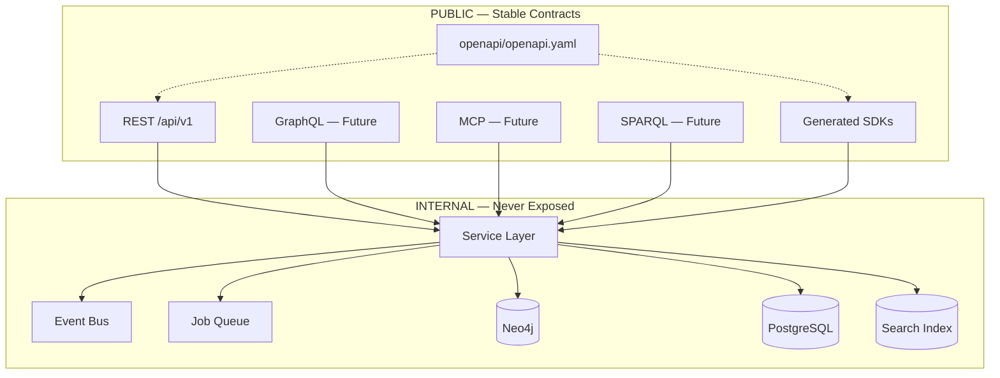

# API-First Architecture

> **Version:** 1.1.0 | **Hard requirement** — The API is the product

## Non-Negotiable Rule

**No client — web app, mobile app, AI tutor, simulator, flashcard generator, research tool, third-party integration, or first-party internal service — may access Neo4j, PostgreSQL, search indexes, or vector stores directly.**

The database is an implementation detail. The API is the stable platform contract.

Violations are architectural defects.

---

## Platform Boundary



---

## API Surfaces

| Surface | Status | Contract source |
|---------|--------|-----------------|
| **REST** | **Live** — auth, curator, dashboard, drugs, search | `openapi/openapi.yaml` |
| **GraphQL** | Future | Ontology-derived schema |
| **MCP** | Future | Tool manifest for LLM agents |
| **SPARQL** | Future | Read-only RDF endpoint |
| **SDK (Python)** | Future | OpenAPI generator |
| **SDK (TypeScript)** | Future | OpenAPI generator |

---

## OpenAPI-First Development

1. **Change the spec first** — `openapi/openapi.yaml` before FastAPI handlers  
2. **Implement to spec** — handlers are spec consumers, not spec authors  
3. **Contract tests** — every endpoint validated against OpenAPI schemas  
4. **SDK generation** — `openapi-generator-cli` in CI  
5. **Mock server** — frontend/integrators develop against mock before backend is ready  

```bash
# Future CI step
openapi-generator-cli generate -i openapi/openapi.yaml -g python -o sdks/python
schemathesis run openapi/openapi.yaml --base-url http://localhost:8000
```

---

## Request Standards

### Required headers (authenticated)

```http
Authorization: Bearer fg_live_...
X-FG-Organization-Id: {org_uuid}      # Future SaaS
X-FG-Workspace-Id: {ws_uuid}          # Future SaaS
X-FG-Dataset-Version: 2027.1.0        # Optional — pin snapshot
X-Request-Id: {uuid}                  # Correlation / tracing
```

### Query parameters (all knowledge endpoints)

| Param | Description |
|-------|-------------|
| `dataset_version` | Pin immutable snapshot (default: latest published) |
| `layers` | `biomedical`, `education`, `learning` (comma-separated) |
| `mode` | `minimal`, `summary`, `full`, `graph` |
| `lang` | Response language (default: `en`) |

---

## Response Envelope

Every response:

```json
{
  "data": {},
  "meta": {
    "api_version": "v1",
    "dataset_version": "2027.1.0",
    "ontology_version": "1.0.0",
    "content_layers": ["biomedical"],
    "language": "en",
    "query_time_ms": 42,
    "snapshot_id": "uuid"
  }
}
```

Explainability responses additionally include `reasoning_chain` and `evidence_ids`.

---

## Versioning Policy

| Change type | Action |
|-------------|--------|
| Add optional field | Minor version, same `/api/v1` |
| Add endpoint | Minor version, same `/api/v1` |
| Remove/rename field | New `/api/v2`, 90-day deprecation |
| Change semantics | New `/api/v2` |

Deprecation: `Sunset` header + changelog + SDK major bump.

---

## Endpoint Catalog

| Category | Endpoints |
|----------|-----------|
| Health | `GET /health` |
| Drugs | `/drugs`, `/drugs/{id}`, `/drugs/{id}/graph`, `/drugs/{id}/mechanism` |
| Entities | `/diseases`, `/pathways`, `/proteins`, `/receptors`, `/enzymes` |
| Clinical | `/interactions`, `/laboratory-tests` |
| Evidence | `/evidence/{id}` |
| Education | `/education`, `/flashcards`, `/cases` |
| Learning | `/drugs/{id}/prerequisites` |
| Reasoning | `/explain`, `/compare` |
| Graph | `/graph/query` |
| Search | `/search`, `/search/autocomplete` |
| Platform | `/modules`, `/statistics`, `/exports` |
| Future AI | `/rag`, `/tutor`, `/reason` |

Full spec: [`openapi/openapi.yaml`](../openapi/openapi.yaml)

---

## MCP Tools (Future)

| Tool | Maps to |
|------|---------|
| `search_drugs` | `GET /search` |
| `get_drug` | `GET /drugs/{id}` |
| `explain_mechanism` | `GET /explain` |
| `compare_drugs` | `POST /compare` |
| `get_prerequisites` | `GET /drugs/{id}/prerequisites` |
| `get_flashcards` | `GET /flashcards` |

All tools return structured data with evidence — never raw graph query access.

---

## SDK Consumer Example (Future)

```python
from farmacograph_sdk import FarmacoGraphClient

client = FarmacoGraphClient(api_key="fg_live_...", dataset_version="2027.1.0")
result = client.explain(drug="ramipril", effect="dry-cough")
for step in result.reasoning_chain:
    print(step.explanation, step.evidence_ids)
```

---

## Related

- [Platform Architecture](platform-architecture.md) — events, jobs, search, plugins, multi-tenant
- [Architecture](architecture.md) — biomedical knowledge model
