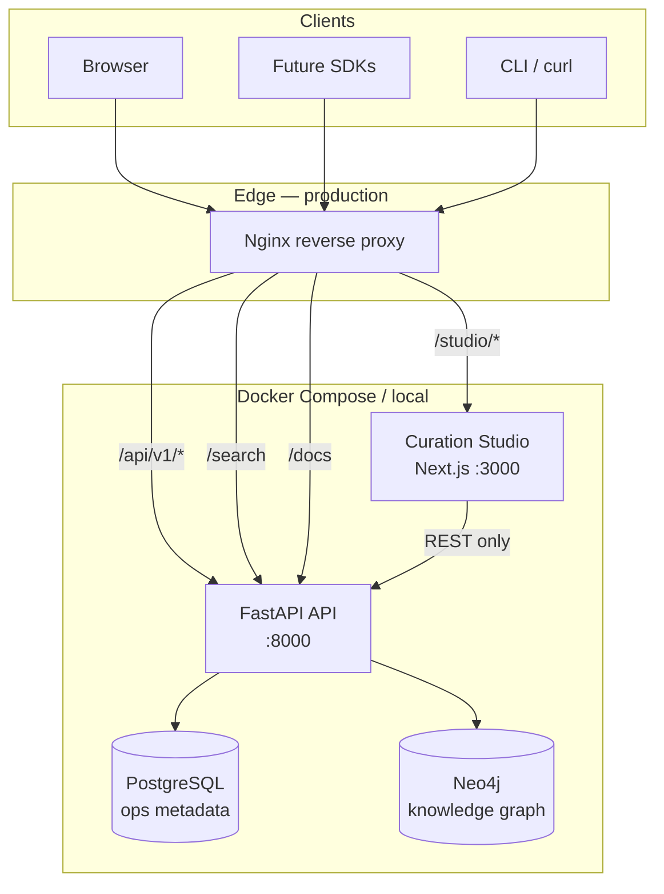
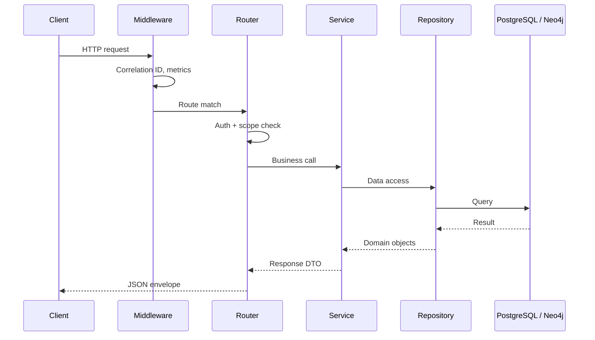
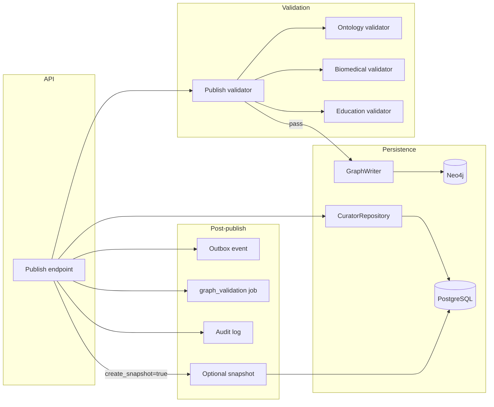
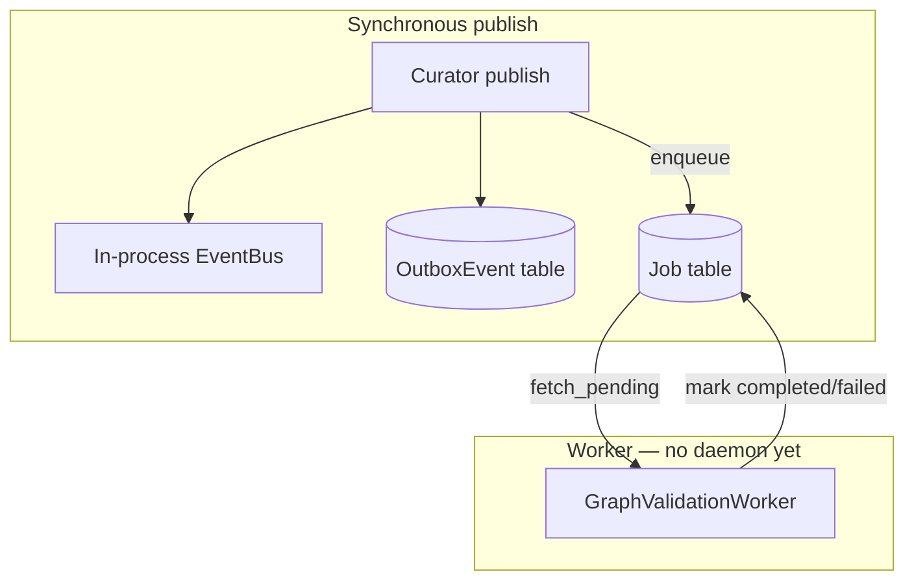
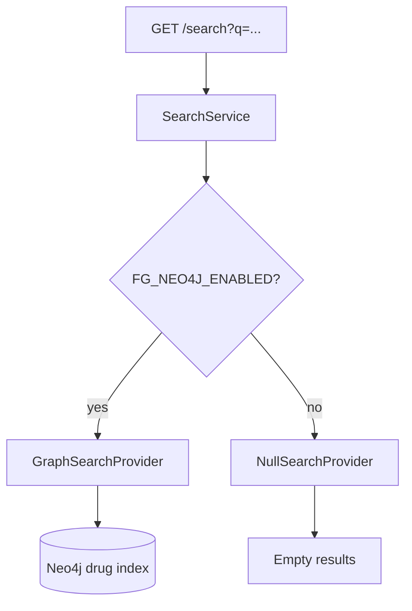
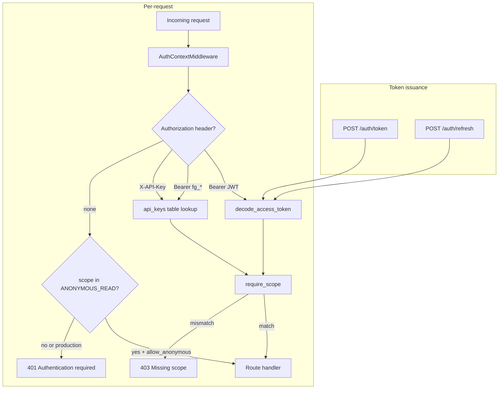

# Runtime Architecture Diagrams

> Implementation-focused diagrams complementing the design documents in [architecture.md](architecture.md) and [platform-architecture.md](platform-architecture.md).

---

## 1. Deployment topology

Current Docker Compose stack and production layout.



| Service | Image / build | Default port |
|---------|---------------|--------------|
| `postgres` | postgres:16-alpine | 5433 |
| `neo4j` | neo4j:5-community | 7474 / 7687 |
| `api` | `Dockerfile` | 8001 |
| `studio` | `apps/studio/Dockerfile` | 3001 |

---

## 2. Request flow (API layer)

All HTTP traffic follows the layered architecture enforced in code.



**Rule:** Routers in `farmacograph/api/routers/` never import database drivers directly.

---

## 3. Curator publish pipeline

End-to-end flow when a workflow is published via `POST /api/v1/curator/workflows/{id}/publish`.



State machine: `draft → review → approved → published → deprecated`

---

## 4. Curation Studio data flow

Studio is a pure API client — no server-side data access.

```mermaid
flowchart LR
    subgraph studio [apps/studio]
        Pages[App Router pages]
        RQ[React Query]
        Client[FarmacoGraphClient]
        Auth[Auth context]
    end

    subgraph api [FarmacoGraph API]
        Dash[/dashboard]
        Health[/health]
        Search[/search]
        Curator[/curator/*]
    end

    Pages --> RQ
    RQ --> Client
    Auth --> Client
    Client -->|Bearer / X-API-Key| Dash & Health & Search & Curator
```

Phase 4.1 wired endpoints: `/health`, `/info`, `/statistics`, `/modules/{slug}/curriculum`, `/curator/queue`, `/drugs`, `/search`, `/dashboard`.

Current Studio UI: drug and disease browsers/editors, validation center, Evidence Manager, publish wizard, snapshots, graph/mechanism previews, and administrator user management are live. Full mechanism pathway authoring, snapshot diff, and AI drafting remain planned.

---

## 4.1 Studio authentication flow

```mermaid
flowchart LR
    subgraph studio [apps/studio]
        Login[/login]
        MW[middleware.ts]
        Gate[AuthGate]
        Client[FarmacoGraphClient]
    end

    subgraph api [API]
        Token[POST /auth/token]
        Refresh[POST /auth/refresh]
        Protected[Protected routes]
    end

    Login --> Token
    Token --> Client
    MW -->|cookie check| Login
    Gate -->|scope check| Protected
    Client -->|Bearer JWT| Protected
    Client -->|401| Refresh
```

---

## 5. Event and job infrastructure



Jobs are enqueued synchronously on publish. A background worker daemon is planned.

---

## 6. Search provider selection



Full-text search (Meilisearch/FTS plugin) is planned — see [api-roadmap.md](api-roadmap.md).

---

## 7. Authentication model



| Component | Path |
|-----------|------|
| Token routes | `farmacograph/api/routers/auth.py` |
| Auth service | `farmacograph/auth/service.py` |
| Request middleware | `farmacograph/auth/middleware.py` |
| Scope dependency | `farmacograph/api/deps.py` → `require_scope` |

**Live:** `POST /auth/token`, `POST /auth/refresh`, and `POST /auth/introspect`.

**Not yet implemented:** rate-limit middleware (Phase API 5.3), self-service API key CRUD.

---

## Related documents

| Document | Focus |
|----------|-------|
| [architecture.md](architecture.md) | Knowledge model, C4 context, hybrid DB |
| [platform-architecture.md](platform-architecture.md) | Events, jobs, search, snapshots, plugins |
| [repository-structure.md](repository-structure.md) | Code layout |
| [phase3-infrastructure.md](phase3-infrastructure.md) | Phase 3 completion status |
| [phase4-curator.md](phase4-curator.md) | Curator API details |
| [studio-roadmap.md](studio-roadmap.md) | Studio implementation phases |
