# FarmacoGraph — Final Architecture

> **Version:** 1.0.0-draft  
> **Status:** Approved for implementation planning  
> **Audience:** Engineers, curators, clinical informaticists, ontology designers

---

## 1. Executive Summary

FarmacoGraph is an **Explainable Biomedical Knowledge Graph** — not a drug database, not a collection of JSON files, and not a memorization deck with metadata attached.

It is ontology-first infrastructure that stores biomedical knowledge as **normalized entities connected by semantically typed, evidence-backed, versioned relationships**. The system is optimized for:

- Medical education and board exam preparation
- Clinical reasoning and mechanism tracing
- Interactive graph visualization
- Retrieval-Augmented Generation (RAG) without hallucination
- Future clinical decision support and medical simulation
- Long-term integration into a multi-module biomedical ecosystem

### Core architectural stance

| Decision | Choice |
|----------|--------|
| Knowledge store | **Neo4j** (canonical graph) from Day One |
| Operational store | **PostgreSQL** (users, audit, versions, config, stats) |
| Domain model | **Normalized entities** — no monolithic Drug blob |
| Mechanisms | **Directed Acyclic Graphs (DAG)** with reusable fragments |
| Evidence | **First-class Evidence entity** linked to relationships |
| Education | **Separate layer** — never mixed with biomedical assertions |
| Ontology | **Defined before database implementation** |
| Dataset rollout | **Organ-system modules**, complete before advancing |
| Terminology | **Open standards first** (ATC, RxNorm, ICD-10, LOINC, MeSH) |
| Code license | Apache 2.0 |
| Documentation license | CC BY 4.0 |
| **Platform model** | **API-first; database is implementation detail** |
| **Multi-tenant** | **Ready (organizations, workspaces, API keys)** |
| **Events** | **Domain event bus with transactional outbox** |
| **Search** | **Separate index; plugin-based providers** |
| **Snapshots** | **Immutable CalVer releases** |
| **Plugins** | **All externals via plugin interfaces** |

---

## 1.1 Platform Architecture

FarmacoGraph is a **biomedical knowledge platform**, not a database project. Phase 3+ infrastructure implements the platform layer defined in:

**[Platform Architecture](platform-architecture.md)** — API-first (hard requirement), multi-tenant readiness, event-driven architecture, background jobs, search, snapshots, import/export, plugins, observability.

Platform specification files:

| File | Purpose |
|------|---------|
| `architecture/events.json` | Domain event catalog |
| `architecture/plugin-interfaces.json` | Plugin type registry |
| `architecture/snapshots.schema.json` | Immutable release manifest |

**Runtime diagrams** (deployment, publish pipeline, Studio data flow): [architecture-diagrams.md](architecture-diagrams.md)

---

## 2. System Context

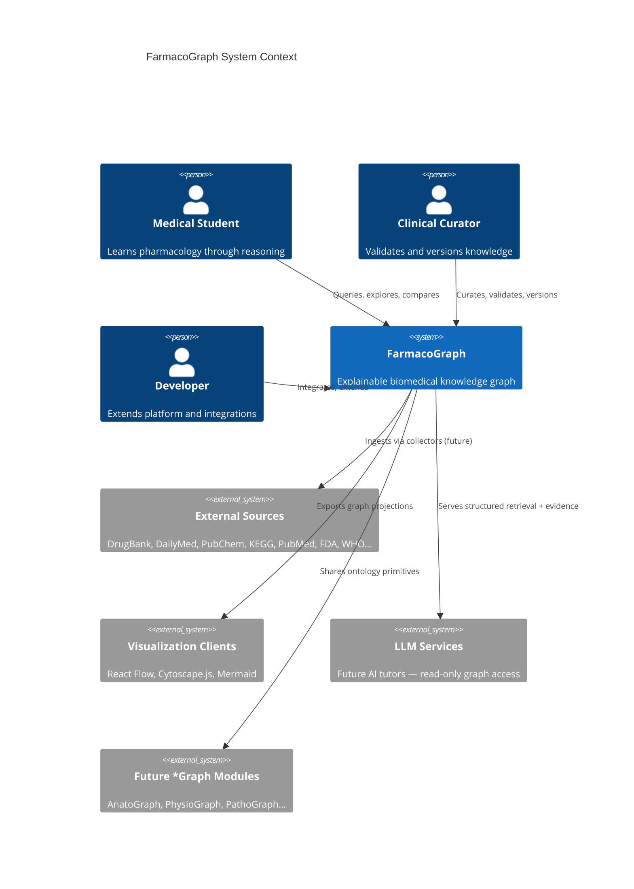

---

## 3. Hybrid Database Architecture

### 3.1 Rationale

The core value of FarmacoGraph is **relationship traversal**. Questions like:

- Drug → Target → Pathway → Disease
- Drug → Side Effect → Mechanism fragment
- Drug → Interaction → CYP Enzyme → Clinical Outcome

are native graph problems. SQL join chains become unmaintainable at the depth and branching required for explainable clinical reasoning.

**Neo4j stores knowledge. PostgreSQL stores operations.**

### 3.2 Responsibility split

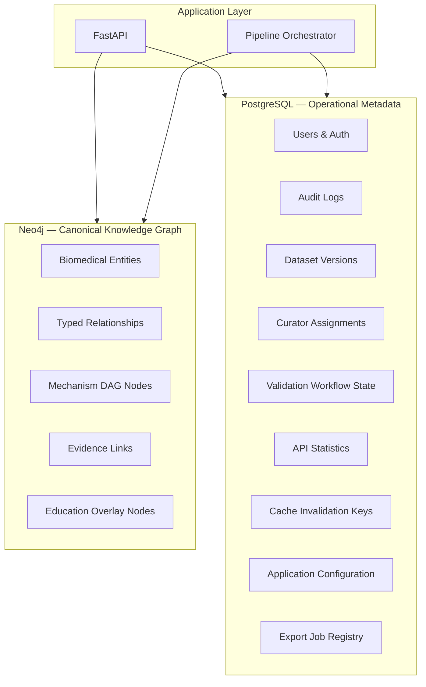

### 3.3 Neo4j contents

| Category | Stored in Neo4j |
|----------|-----------------|
| All biomedical entities | Yes |
| All ontology relationships | Yes |
| Mechanism DAG structure | Yes |
| Evidence entities + links to edges | Yes |
| Education layer content | Yes (separate node labels) |
| Entity versioning metadata | Yes (on nodes and edges) |
| External identifier mappings | Yes (as properties) |

### 3.4 PostgreSQL contents

| Category | Stored in PostgreSQL |
|----------|---------------------|
| User accounts, roles, sessions | Yes |
| Authentication tokens | Yes |
| Audit trail (who changed what, when) | Yes |
| Dataset release manifests | Yes |
| Curator workflow (draft → review → publish) | Yes |
| API request logs and aggregates | Yes |
| Application configuration | Yes |
| Background job state | Yes |
| Cached query fingerprints (optional) | Yes |
| **Biomedical facts** | **No** |

### 3.5 Sync contract

- PostgreSQL holds the **release manifest**: which `dataset_version` is published, who approved it, export checksums
- Neo4j holds the **knowledge state** for that version
- Publishing a dataset version is an atomic operation: validate graph → tag version → update manifest → invalidate caches
- Historical knowledge versions remain queryable in Neo4j via `valid_from` / `valid_to` on nodes and relationships

---

## 4. Layered Architecture

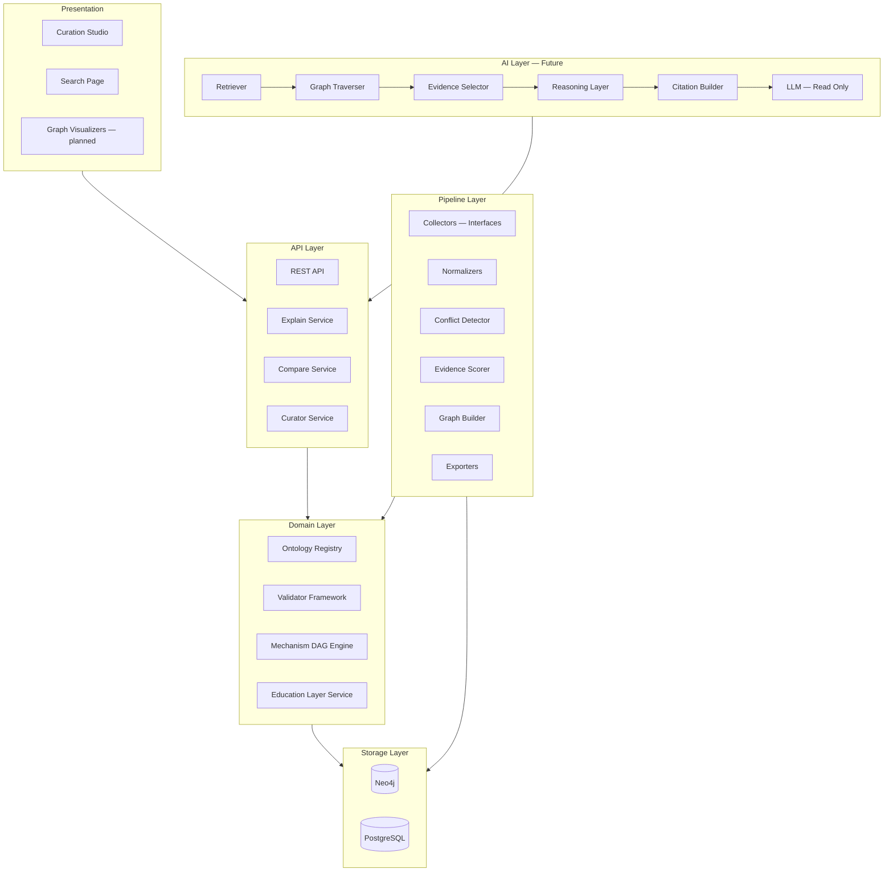

### Layer responsibilities

| Layer | Responsibility |
|-------|----------------|
| **Ontology** | Entity types, relationship semantics, constraints |
| **Domain** | Business rules, mechanism DAG logic, education separation |
| **Pipeline** | Ingestion, validation, conflict resolution, graph construction |
| **Storage** | Neo4j knowledge + PostgreSQL operations |
| **API** | Stable query contracts, explainability responses |
| **AI** | RAG over validated graph only — never writes facts |
| **Presentation** | Curation Studio — dashboard, search, auth, drug browser, drug editor, validation center (live); graph explorer, publish wizard (planned) |

### 4.1 Curation Studio (implementation status)

The primary curator interface is `apps/studio` — a Next.js App Router client that talks only to the REST API.

| Module | Route | Status |
|--------|-------|--------|
| Dashboard | `/` | Live — ops metrics, curator queue, validation summary |
| Authentication | `/login`, `/settings` | Live — `POST /auth/token`, `/auth/refresh`, API keys |
| Global search | `/search` | Live — `GET /search` |
| Drug browser | `/knowledge/drugs` | Live — list, filter, sort, workflow status overlay |
| Drug editor | `/knowledge/drugs/[id]` | Live — sectioned editing, curator draft autosave, live validation |
| Validation Center | `/validation` | Live — grouped issues, publish readiness, queue dry-runs |
| Other knowledge surfaces | `/knowledge/diseases`, `/knowledge/evidence`, `/knowledge/education`, `/knowledge/mechanisms` | Disease + evidence live; education/mechanism connected surfaces until editor APIs land |
| Graph Explorer | `/graph` | Connected surface; interactive graph query/canvas deferred |
| Publish / snapshots | `/snapshots` | Connected snapshot marker; full release diff manager deferred |

See [curation-studio.md](curation-studio.md) and [studio-roadmap.md](studio-roadmap.md).

### 4.2 Authentication model

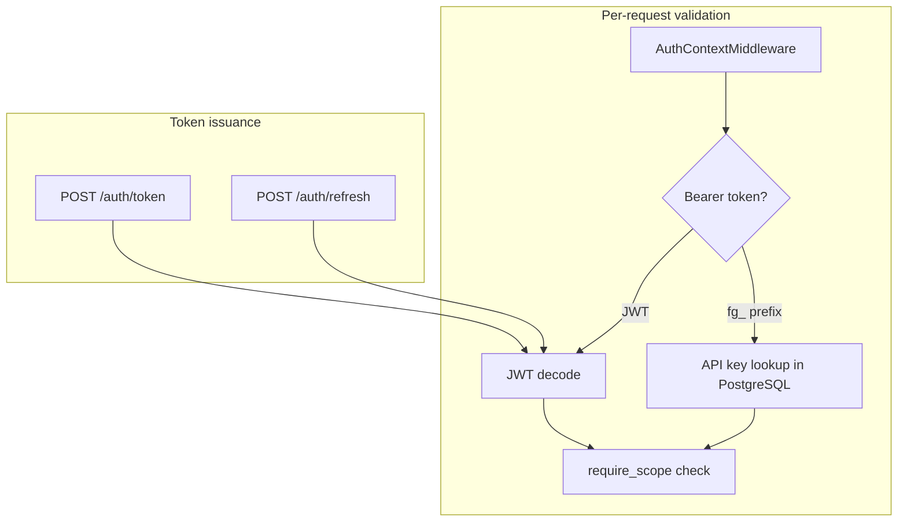

| Concern | Implementation |
|---------|----------------|
| Users & passwords | PostgreSQL `users` table; bcrypt via `passlib` |
| API keys | PostgreSQL `api_keys` — prefix + SHA-256 hash; format `fg_{prefix}_{secret}` |
| Token grants | `POST /auth/token` — `password` or `api_key` grant types |
| Token refresh | `POST /auth/refresh` — rotate access/refresh pair |
| Credential introspection | `POST /auth/introspect` — scopes, roles, identity |
| Direct API key use | `Authorization: Bearer fg_…` or `X-API-Key` header (no JWT required) |
| Scopes | JWT payload + `UserRole.scopes`; `admin:org` is super-scope |
| Anonymous read | Allowed when `FG_ALLOW_ANONYMOUS_READ=true` (development default; disabled in production) |
| Curator protection | `curator:write` / `curator:publish` require authentication |

Implementation: `farmacograph/auth/`, `farmacograph/api/routers/auth.py`, `farmacograph/api/deps.py`

### 4.3 Curator draft persistence (autosave)

Drug edits in Studio do **not** write directly to Neo4j. The canonical save path is:

1. Open or create a curator workflow (`POST /curator/drugs/{slug}/workflows` or `POST /curator/workflows`).
2. Autosave the publish package to PostgreSQL via `PUT /curator/workflows/{id}/package`.
3. Dry-run validation in parallel via `POST /curator/validate`.
4. Transition through `submit` → `approve` → `publish` to commit knowledge to Neo4j.

`PATCH /drugs/{id}` is not implemented; all draft state lives in `draft_package_json` until publish.

---

## 5. Normalized Domain Model

### 5.1 Principle

**No monolithic Drug object.** Each biomedical concept is an independent entity that exists exactly once. Drugs are **entry points** into the graph, not containers of duplicated knowledge.

A `Drug` node connects to shared `Enzyme`, `Pathway`, `SideEffect`, and `Evidence` nodes that other drugs may also reference.

### 5.2 Entity catalog

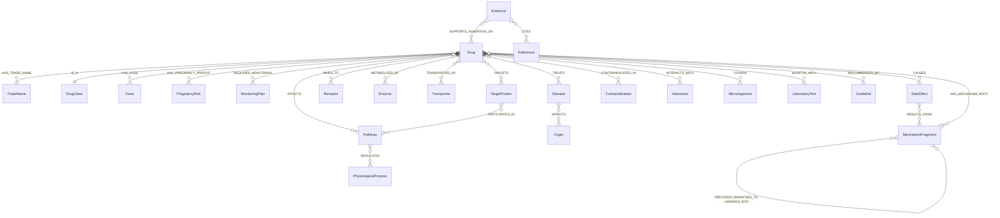

### 5.3 Entity groups

| Group | Entities |
|-------|----------|
| **Pharmacologic** | Drug, DrugClass, TradeName, Dose |
| **Molecular** | TargetProtein, Receptor, Enzyme, Transporter, Pathway |
| **Physiologic** | PhysiologicalProcess, Organ, CellType |
| **Clinical** | Disease, SideEffect, Contraindication, Interaction, LaboratoryTest, Microorganism |
| **Mechanistic** | MechanismStep, MechanismFragment (DAG nodes) |
| **Evidence** | Evidence, Reference, Guideline |
| **Educational** | ClinicalPearl, ExamFact, Mnemonic, LearningObjective, Flashcard, FAQ, ClinicalScenario |
| **Operational** | (PostgreSQL only) User, AuditEntry, DatasetVersion |

### 5.4 Drug as graph entry point

A `Drug` entity carries **identity and pharmacologic summary properties only**:

- Identifiers (internal UUID, slug, ATC, RxNorm, PubChem, DrugBank where licensed)
- Names and synonyms
- High-level classification pointer
- PK/PD summary scalars where they are drug-intrinsic
- Status and versioning metadata

Everything else — targets, pathways, side effects, interactions — is **relationships to shared nodes**, never embedded copies.

---

## 6. Mechanism Model — Directed Acyclic Graphs

### 6.1 Why not linear lists

Pharmacologic mechanisms branch and merge. Metformin does not follow a single chain:

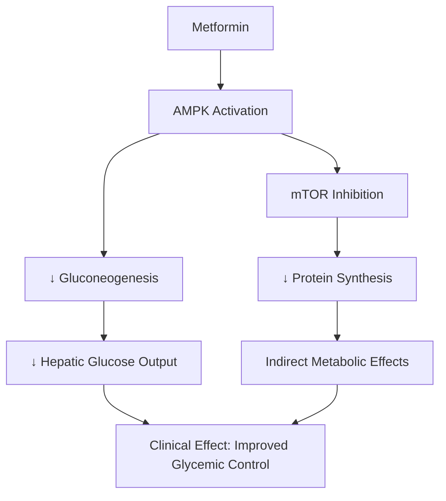

Linear `MechanismStep[0..n]` cannot represent this without duplicating `AMPK Activation` or losing merge semantics.

### 6.2 Mechanism DAG structure

| Node type | Role |
|-----------|------|
| `MechanismFragment` | Reusable mechanistic unit (e.g., "ACE inhibition", "Bradykinin accumulation") |
| `MechanismStep` | Instance of a fragment in a specific drug context |
| `PhysiologicalProcess` | System-level process being modulated |
| `ClinicalOutcome` | Observable clinical result |

| Edge type | Semantics |
|-----------|-----------|
| `PRECEDES` | Sequential causation (A must occur before B) |
| `BRANCHES_TO` | One output splits into parallel paths |
| `MERGES_INTO` | Multiple inputs converge |
| `MODULATES` | Up/down regulation without strict ordering |
| `RESULTS_IN` | Terminal link to clinical outcome |

### 6.3 Reusable fragments

Mechanism fragments are **shared across drugs** where biochemistry is identical:

- "Bradykinin accumulation" → linked from Ramipril, Enalapril, Captopril
- Each drug has a `HAS_MECHANISM_ROOT` edge to its entry fragment
- Fragment DAG is validated for acyclicity on publish

### 6.4 DAG integrity rules

- No cycles in mechanism subgraphs
- Every terminal node must `RESULTS_IN` a `ClinicalOutcome`, `SideEffect`, or `PhysiologicalProcess`
- Every edge in the mechanism DAG must have `mechanism_explanation` metadata
- Orphan fragments (unreachable from any Drug root) fail validation on publish

---

## 7. Versioning & Provenance

### 7.1 Every fact is versioned

All biomedical nodes and relationships in Neo4j carry:

| Property | Description |
|----------|-------------|
| `created_at` | ISO 8601 timestamp |
| `updated_at` | Last modification |
| `source` | Origin system (manual, drugbank, fda_label, pubmed, ...) |
| `dataset_version` | Release tag (CalVer: `2026.1.0`) |
| `curator_id` | PostgreSQL user reference |
| `confidence_score` | 0.0–1.0 computed by evidence scorer |
| `evidence_level` | A / B / C / D / expert_consensus |
| `status` | draft / validated / published / deprecated |
| `validation_state` | pending / passed / failed / needs_review |
| `valid_from` | When this assertion became active |
| `valid_to` | When superseded (null if current) |
| `deprecated` | Boolean |
| `superseded_by` | Pointer to replacement node/edge ID |

### 7.2 Historical queries

```cypher
// Conceptual — drug–target relationship as of a prior release
MATCH (d:Drug {slug: 'ramipril'})-[r:INHIBITS]->(e:Enzyme)
WHERE r.valid_from <= date('2025-06-01')
  AND (r.valid_to IS NULL OR r.valid_to > date('2025-06-01'))
RETURN d, r, e
```

### 7.3 PostgreSQL version manifest

```text
dataset_versions
  id, version_tag, released_at, released_by, neo4j_snapshot_id,
  entity_count, relationship_count, validation_report_hash, status
```

---

## 8. Evidence Layer

### 8.1 Evidence as first-class entity

References are **not strings on relationships**. `Evidence` is a node type:

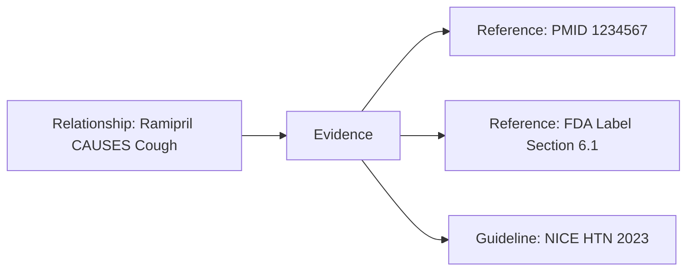

### 8.2 Evidence types

| Type | Description |
|------|-------------|
| `pubmed_article` | Peer-reviewed publication |
| `fda_label` | FDA prescribing information |
| `ema_smpc` | EMA Summary of Product Characteristics |
| `who_guideline` | WHO recommendation |
| `nice_guideline` | NICE clinical guideline |
| `rct` | Randomized controlled trial |
| `meta_analysis` | Systematic review / meta-analysis |
| `review_article` | Narrative review |
| `expert_consensus` | Panel consensus — lowest tier, flagged |
| `textbook` | Standard reference text |
| `clinical_guideline` | Generic guideline type |

### 8.3 Evidence node properties

- `evidence_type`, `title`, `authors`, `year`
- `quality_score` (computed)
- `extract` — relevant quoted passage
- `supports` — what claim this evidence supports (structured)
- Links to `Reference` nodes (DOI, PMID, URL, access_date)

### 8.4 Relationship to edges

Every clinical relationship **optionally** links to one or more `Evidence` nodes via `SUPPORTED_BY`. Published relationships require ≥1 `SUPPORTED_BY` unless `evidence_level = expert_consensus` with curator attestation.

---

## 9. Explainability Metadata

Every relationship stores a standardized metadata envelope (Neo4j relationship properties + linked Evidence):

| Field | Required | Description |
|-------|----------|-------------|
| `explanation` | Yes (published) | Why this relationship exists |
| `clinical_significance` | Recommended | Why it matters at the bedside |
| `mechanism_summary` | For mechanistic edges | Brief mechanistic narrative |
| `conditions` | Optional | Population, dose, co-morbidity qualifiers |
| `confidence_score` | Yes | 0.0–1.0 |
| `evidence_level` | Yes | A–D or expert_consensus |
| `supported_by` | Yes (published) | Evidence node IDs |

This envelope powers `/explain`, visualization tooltips, and the AI citation builder without additional inference.

---

## 10. Education Layer

### 10.1 Separation principle

Educational content is **never stored as biomedical fact**. It lives in a parallel layer of nodes linked to drugs via `HAS_EDUCATION` edges.

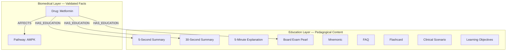

### 10.2 Education content types

| Type | Purpose |
|------|---------|
| `FiveSecondSummary` | Ultra-brief recall |
| `ThirtySecondSummary` | Viva-style answer |
| `FiveMinuteExplanation` | Mechanism + clinical context |
| `BoardExamPearl` | High-yield exam fact |
| `CommonMistake` | Typical student error |
| `HighYieldFact` | Tagged for spaced repetition |
| `Mnemonic` | Memory aid — clearly labeled non-factual |
| `ClinicalScenario` | Case-based application |
| `Flashcard` | Front/back pair with source links |
| `FAQ` | Frequently asked question |
| `ComparisonTable` | Structured multi-drug comparison |
| `VisualExplanation` | Diagram spec (Mermaid/React Flow JSON) |
| `LearningObjective` | Outcome-aligned goal |
| `DifficultyLevel` | beginner / intermediate / advanced |
| `RevisionChecklist` | Module review items |

### 10.3 Education metadata

- `audience`: MBBS / USMLE / TUS / resident
- `difficulty_level`
- `curator_id`, `reviewed_at`
- `linked_biomedical_nodes[]` — explicit links to facts this content illustrates (not asserts)

---

## 11. AI Architecture — RAG over the Graph

### 11.1 Pipeline

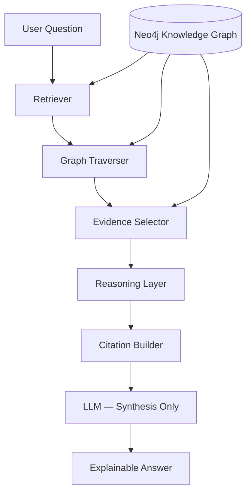

### 11.2 Component contracts

| Component | Input | Output | Constraint |
|-----------|-------|--------|------------|
| **Retriever** | Natural language question | Candidate entity IDs | No generation |
| **Graph Traverser** | Entity IDs + intent | Paths with metadata | Read-only Cypher |
| **Evidence Selector** | Paths | Ranked Evidence nodes | Quality score ≥ threshold |
| **Reasoning Layer** | Paths + evidence | Structured reasoning chain | No new entities |
| **Citation Builder** | Reasoning chain | Formatted references | Every claim mapped |
| **LLM** | Chain + citations | Natural language | Must not add facts |

### 11.3 Failure modes

| Condition | Response |
|-----------|----------|
| No graph path found | "Not in knowledge base" — no hallucination |
| Low confidence evidence | Answer with explicit uncertainty flag |
| Conflicting evidence | Present both with evidence levels |
| Education-only content | Label as "pedagogical aid, not clinical fact" |

---

## 12. Visualization Architecture

### 12.1 Export formats

| Format | Consumer |
|--------|----------|
| Neo4j native | Browser, Bloom |
| Cypher subgraph queries | API `/graph` endpoint |
| JSON graph projection | React Flow, Cytoscape.js |
| GraphML | Desktop tools |
| Mermaid diagram spec | Docs, education layer |
| PNG/SVG | Static exports (future) |

### 12.2 Visualization modes

| Mode | Graph pattern |
|------|---------------|
| Mechanism chain | Drug → Mechanism DAG → Outcome |
| Side effect chain | Drug → CAUSES → SideEffect → RESULTS_FROM → Fragment |
| Interaction network | Drug ↔ INTERACTS_WITH ↔ Drug |
| Disease treatment map | Disease ← TREATS ← Drug |
| Receptor map | Drug → BINDS_TO → Receptor |
| Pathway map | Drug → AFFECTS → Pathway → REGULATES → Process |
| Antibiotic coverage | Drug → COVERS → Microorganism |
| CYP map | Drug → METABOLIZED_BY / INHIBITS → Enzyme |
| Pregnancy safety | Drug → HAS_PREGNANCY_PROFILE |
| Organ system map | Drug → affects → Organ |
| Drug comparison | Multi-root subgraph union |

### 12.3 React Flow / Cytoscape contract

API returns:

```json
{
  "nodes": [{"id": "...", "type": "Drug", "label": "...", "data": {...}}],
  "edges": [{"id": "...", "source": "...", "target": "...", "type": "INHIBITS", "data": {"explanation": "..."}}],
  "layout_hint": "dagre | force | radial",
  "evidence_refs": ["evidence-uuid-1"]
}
```

---

## 13. Data Pipeline

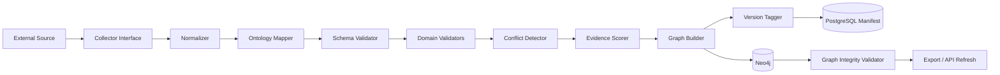

### Pipeline rules

1. No AI-generated facts without `status: draft` and curator review
2. Publish path fails on any validation error
3. Conflicts route to curator queue in PostgreSQL
4. Normalizers map external IDs to ontology entities (create-or-link)
5. Mechanism DAG validated for acyclicity before commit

---

## 14. Repository Structure

```
farmacograph/
├── configs/
├── docs/                          # Architecture, ontology, API (this document set)
├── ontology/                      # OWL/Turtle/JSON-LD ontology definitions
│   ├── farmacograph-core.ttl
│   ├── relationships.json
│   └── constraints.shacl          # SHACL shapes (future)
├── schemas/                       # JSON Schema generated from domain models
├── farmacograph/
│   ├── models/                    # Pydantic — one file per entity group
│   ├── ontology/                  # Ontology registry, relationship enums
│   ├── collectors/                # Abstract interfaces only (Phase 1)
│   ├── parsers/
│   ├── validators/
│   ├── pipeline/
│   ├── mechanism/                 # DAG builder, cycle detector, fragment registry
│   ├── graph/                     # Neo4j projections, Cypher templates
│   ├── education/                 # Education layer service
│   ├── exporters/
│   ├── api/
│   ├── services/
│   │   ├── explain_service.py
│   │   ├── rag_retriever.py       # Future
│   │   └── visualization_service.py
│   ├── db/
│   │   ├── neo4j/
│   │   └── postgres/
│   └── cli/
├── tests/
├── examples/                      # Structural stubs only — no fake pharmacology
└── datasets/                      # Versioned exports
```

---

## 15. API Overview

Base path: `/api/v1`

| Endpoint | Purpose |
|----------|---------|
| `GET /drugs` | List with filters |
| `GET /drugs/{id}` | Drug with relationship summaries |
| `GET /drugs/{id}/graph` | Subgraph for visualization |
| `GET /drugs/{id}/mechanism` | Mechanism DAG projection |
| `GET /drugs/{id}/education` | Education layer content |
| `GET /entities/{type}/{id}` | Any entity by type |
| `GET /pathways/{id}` | Pathway neighborhood |
| `GET /interactions` | Interaction query |
| `GET /search` | Full-text entity search |
| `POST /graph/query` | Parameterized read-only Cypher |
| `GET /explain` | Structured reasoning chain |
| `POST /compare` | Multi-drug comparison subgraph |
| `GET /visualize/{mode}` | React Flow / Cytoscape JSON |

See [api.md](api.md) for full contracts.

---

## 16. Ecosystem Architecture

FarmacoGraph shares a **core ontology primitive layer** with future modules:

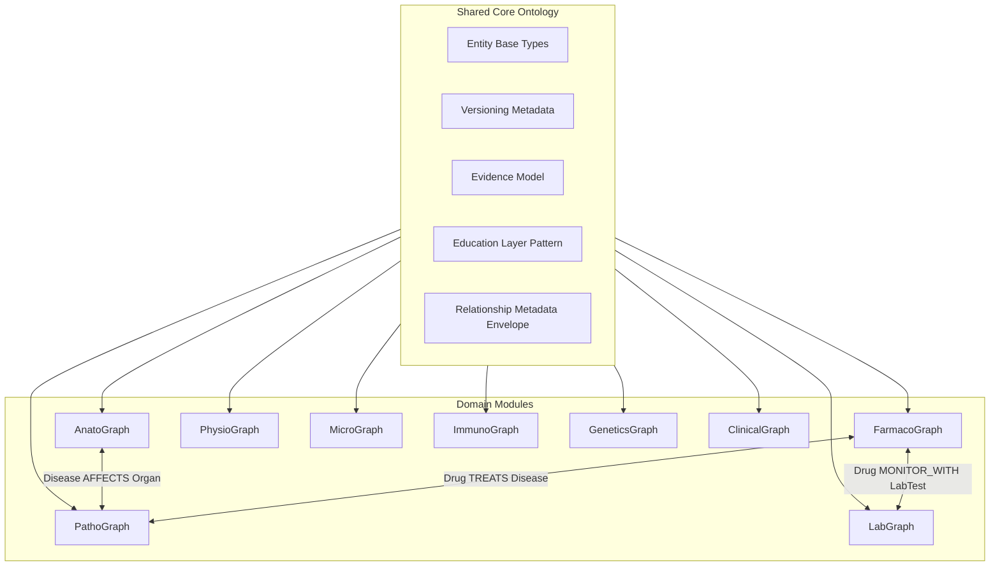

### Cross-module relationship examples

| From | Relationship | To | Module |
|------|-------------|-----|--------|
| Drug | TREATS | Disease | FarmacoGraph ↔ PathoGraph |
| Drug | MONITOR_WITH | LaboratoryTest | FarmacoGraph ↔ LabGraph |
| Disease | AFFECTS | Organ | PathoGraph ↔ AnatoGraph |
| Drug | COVERS | Microorganism | FarmacoGraph ↔ MicroGraph |
| Pathway | INVOLVES | Protein | FarmacoGraph ↔ GeneticsGraph |

### Shared identifiers

All modules use the same external ID registry pattern: `rxnorm:`, `icd10:`, `loinc:`, `mesh:`, `pubchem:`, `uniprot:`.

---

## 17. Identified Weaknesses & Mitigations

| Weakness | Risk | Mitigation |
|----------|------|------------|
| Neo4j as canonical store | Operational complexity, backup/restore | Automated snapshots; dataset version manifests in PostgreSQL; export to JSON after each publish |
| DAG mechanism complexity | Curator burden | Reusable `MechanismFragment` library; UI-assisted DAG builder (future); validate early |
| Evidence curation scale | 600+ drugs × many edges | Evidence on publish-critical edges first; tiered evidence requirements by edge type |
| Education/biomedical bleed | Students treat mnemonics as facts | Strict layer separation; API flags `content_layer: education \| biomedical` |
| Cross-module ontology drift | Incompatible future modules | Shared `core` ontology package; relationship registry versioned independently |
| SNOMED/MedDRA licensing | Gaps in terminology | Open standards first; plugin architecture for licensed terminologies |
| LLM over-reliance | Misleading explanations | LLM synthesis-only; reasoning chain required in every response; confidence thresholds |
| DrugBank license | Redistribution limits | Store IDs + attribution; regenerate from licensed sources per dataset license doc |
| Graph query performance | Deep traversals slow | Indexed relationship types; materialized views for common patterns; query depth limits |
| Curator bottleneck | Single point of failure | Multi-curator workflow in PostgreSQL; draft/validated/published states; community contribution with review |

---

## 18. Technology Stack

| Component | Technology |
|-----------|------------|
| Language | Python 3.12+ |
| Domain models | Pydantic v2 |
| API | FastAPI |
| CLI | Typer |
| Knowledge graph | Neo4j 5.x |
| Operational DB | PostgreSQL 16 |
| Ontology | OWL/Turtle + JSON relationship registry |
| Migrations (PG) | Alembic |
| Testing | pytest, testcontainers |
| Docs | MkDocs Material |
| Visualization API | JSON graph projections for React Flow / Cytoscape |
| CI | GitHub Actions |

---

## 19. Implementation Readiness Checklist

- [x] Hybrid Neo4j + PostgreSQL architecture decided
- [x] Normalized domain model specified
- [x] Mechanism DAG model specified
- [x] Versioning and provenance model specified
- [x] Evidence layer specified
- [x] Education layer separation specified
- [x] AI/RAG architecture specified
- [x] Visualization contracts specified
- [x] Ontology semantics defined (see [ontology.md](ontology.md))
- [x] License strategy defined (see [licensing.md](licensing.md))
- [x] Phased dataset strategy defined (see [roadmap.md](roadmap.md))
- [x] Ecosystem expansion pattern defined
- [x] **Platform architecture** (API-first, events, jobs, search, plugins) — see [platform-architecture.md](platform-architecture.md)
- [ ] OWL ontology files authored
- [x] Pydantic models generated
- [ ] Neo4j constraints and indexes defined
- [ ] PostgreSQL schema defined (including tenant, job, outbox tables)
- [x] Validator framework implemented
- [ ] Pipeline orchestrator implemented
- [ ] API skeleton implemented (service layer — no direct DB in handlers)

**Implementation may begin after ontology files and schema definitions are approved.**
