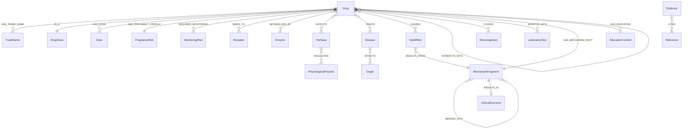

# FarmacoGraph Data Model

> **Version:** 1.0.0-draft  
> Normalized entity specifications — no monolithic Drug object

---

## 1. Modeling Philosophy

FarmacoGraph rejects the "one giant Drug JSON document" anti-pattern. Each biomedical concept is a **first-class entity** stored once in Neo4j. A drug is an entry point into a graph of shared knowledge.

**Wrong:** Copy "ACE inhibition" mechanism text into every ACE inhibitor drug record.  
**Right:** One `MechanismFragment: ACE Inhibition` node; all ACE inhibitors link to it.

---

## 2. Base Entity Schema

All biomedical entities inherit `BiomedicalEntity` properties:

```yaml
BiomedicalEntity:
  id: UUID                    # Internal canonical ID
  slug: string                # URL-safe unique identifier
  label: string               # Primary display name
  synonyms: string[]          # Alternative names
  description: string | null    # Optional definition
  external_ids:                # Vocabulary map
    rxnorm: string | null
    mesh: string | null
  # Versioning & provenance
  created_at: datetime
  updated_at: datetime
  source: string              # manual | drugbank | fda_label | pubmed | ...
  dataset_version: string     # e.g. 2026.1.0
  curator_id: string          # PostgreSQL user reference
  confidence_score: float     # 0.0–1.0
  evidence_level: A | B | C | D | expert_consensus
  status: draft | validated | published | deprecated
  validation_state: pending | passed | failed | needs_review
  valid_from: date
  valid_to: date | null
  deprecated: boolean
  superseded_by: UUID | null
```

Educational entities inherit `EducationEntity` (extends base with `content_layer: education`):

```yaml
EducationEntity:
  # ...BiomedicalEntity fields except evidence_level optional
  content_layer: education    # Always "education"
  audience: string[]          # MBBS | USMLE | TUS | resident
  difficulty_level: beginner | intermediate | advanced
  reviewed_at: datetime | null
  linked_entity_ids: UUID[]   # Biomedical nodes this illustrates
```

---

## 3. Entity Specifications

### 3.1 Drug

Identity and drug-intrinsic properties only. Relationships handle everything else.

```yaml
Drug:
  # Identity
  generic_name: string        # Required
  pronunciation: string | null
  # Classification (pointer — full hierarchy via IS_A edge)
  primary_class_id: UUID | null
  atc_codes: string[]         # Required for published
  # Pharmacokinetic summary (drug-intrinsic scalars)
  bioavailability: string | null
  protein_binding: string | null
  half_life: string | null
  volume_of_distribution: string | null
  clearance: string | null
  absorption: string | null
  routes: string[]            # oral | IV | IM | topical | ...
  elimination: string | null
  # Pharmacodynamic summary
  onset: string | null
  peak_effect: string | null
  duration: string | null
  # Safety flags (scalar summaries — details via edges)
  has_black_box_warning: boolean
  black_box_text: string | null
  is_high_alert: boolean
  # External IDs
  external_ids:
    rxnorm: string
    pubchem: string | null
    drugbank: string | null   # Where license permits
```

**Relationships (not embedded):**

- `IS_A` → DrugClass
- `HAS_TRADE_NAME` → TradeName
- `TARGETS` / `BINDS_TO` → Receptor, TargetProtein
- `METABOLIZED_BY` → Enzyme
- `AFFECTS` → Pathway
- `TREATS` → Disease
- `CAUSES` → SideEffect
- `INTERACTS_WITH` → Drug
- `HAS_MECHANISM_ROOT` → MechanismFragment
- `HAS_EDUCATION` → EducationEntity

---

### 3.2 DrugClass

```yaml
DrugClass:
  name: string
  atc_prefix: string | null   # e.g. C09A
  description: string | null
  parent_class_id: UUID | null
  level: int                  # Depth in hierarchy
  organ_system: string | null # cardiovascular | endocrine | ...
```

---

### 3.3 Disease

```yaml
Disease:
  name: string
  icd10: string | null
  mesh: string | null
  description: string | null
  prevalence_note: string | null
```

Relationships: `AFFECTS` → Organ; `TREATS` ← Drug; `FIRST_LINE_FOR` ← Drug

---

### 3.4 TargetProtein

```yaml
TargetProtein:
  name: string
  uniprot: string | null
  gene_symbol: string | null
  protein_type: string | null  # enzyme | receptor | ion_channel | ...
  function: string | null
```

Relationships: `PARTICIPATES_IN` → Pathway; `TARGETS` ← Drug

---

### 3.5 Receptor

```yaml
Receptor:
  name: string
  family: string              # GPCR | nuclear | ion_channel | ...
  subtype: string | null      # beta-1 | beta-2 | ...
  endogenous_ligand: string | null
```

---

### 3.6 Enzyme

```yaml
Enzyme:
  name: string
  ec_number: string | null
  is_cyp: boolean
  cyp_family: string | null   # CYP3A4 | CYP2D6 | ...
  is_ugt: boolean
  ugt_family: string | null
```

Relationships: `METABOLIZED_BY` ← Drug; `INHIBITS` / `INDUCES` ← Drug

---

### 3.7 Transporter

```yaml
Transporter:
  name: string
  type: uptake | efflux
  substrate_note: string | null
```

---

### 3.8 Pathway

```yaml
Pathway:
  name: string
  kegg: string | null
  reactome: string | null
  description: string | null
  pathway_type: signaling | metabolic | immune | ...
```

Relationships: `REGULATES` → PhysiologicalProcess; `PART_OF` → Pathway (parent)

---

### 3.9 PhysiologicalProcess

```yaml
PhysiologicalProcess:
  name: string
  mesh: string | null
  direction: increase | decrease | modulate | unknown
  organ_system: string | null
```

---

### 3.10 Organ

```yaml
Organ:
  name: string
  system: string              # cardiovascular | renal | hepatic | ...
  laterality: bilateral | left | right | na
```

---

### 3.11 CellType

```yaml
CellType:
  name: string
  organ_id: UUID | null
  function: string | null
```

---

### 3.12 SideEffect

```yaml
SideEffect:
  name: string
  frequency: very_common | common | uncommon | rare | very_rare | unknown
  severity: mild | moderate | severe | life_threatening
  organ_system: string | null
  meddra_code: string | null  # Optional plugin
```

Relationships: `RESULTS_FROM` → MechanismFragment; `CAUSES` ← Drug

---

### 3.13 Contraindication

```yaml
Contraindication:
  name: string
  type: absolute | relative
  rationale: string
  condition_type: disease | pregnancy | age | lab_value | ...
```

---

### 3.14 Interaction

Interaction is modeled as a **relationship between two Drug nodes** with rich metadata, plus an optional `Interaction` node for complex multi-party interactions.

```yaml
Interaction:
  severity: minor | moderate | major | contraindicated
  interaction_type: pharmacokinetic | pharmacodynamic | both
  mechanism: string
  clinical_effect: string
  management: string
  onset: rapid | delayed | unknown
```

Edge: `(Drug)-[:INTERACTS_WITH {metadata}]->(Drug)` — always bidirectional.

---

### 3.15 LaboratoryTest

```yaml
LaboratoryTest:
  name: string
  loinc: string | null
  unit: string | null
  normal_range: string | null
  direction_of_change: increase | decrease | variable | unknown
```

---

### 3.16 Microorganism

```yaml
Microorganism:
  name: string
  gram_stain: positive | negative | acid_fast | fungal | viral | na
  species: string | null
  resistance_notes: string | null
```

---

### 3.17 Dose

```yaml
Dose:
  amount: string              # "500 mg" — stored as string for clinical flexibility
  route: string
  frequency: string
  population: adult | pediatric | geriatric | renal | hepatic | generic
  indication_context: string | null
  max_dose: string | null
  titration: string | null
  renal_adjustment: string | null
  hepatic_adjustment: string | null
  egfr_threshold: string | null
```

---

### 3.18 PregnancyRisk

```yaml
PregnancyRisk:
  fda_category: string | null       # Legacy categories where applicable
  pllr_narrative: string | null       # Pregnancy and Lactation Labeling Rule
  pregnancy_recommendation: string
  lactation_safety: safe | caution | avoid | unknown
  lactation_notes: string | null
  teratogenicity_risk: string | null
```

---

### 3.19 MonitoringPlan

```yaml
MonitoringPlan:
  parameter: string
  frequency: string
  rationale: string
  threshold_action: string | null   # What to do if abnormal
  baseline_required: boolean
```

---

### 3.20 MechanismFragment

```yaml
MechanismFragment:
  name: string
  description: string
  is_reusable: boolean          # True = shared across drugs
  fragment_type: molecular | cellular | tissue | organ | clinical
  direction: increase | decrease | inhibit | activate | unknown
```

DAG edges: `PRECEDES`, `BRANCHES_TO`, `MERGES_INTO`, `MODULATES`, `RESULTS_IN`

---

### 3.21 MechanismStep

Drug-specific binding of a fragment in context:

```yaml
MechanismStep:
  fragment_id: UUID           # Links to MechanismFragment
  drug_id: UUID
  context_note: string | null # Drug-specific nuance
```

---

### 3.22 ClinicalOutcome

```yaml
ClinicalOutcome:
  name: string
  outcome_type: therapeutic | adverse | neutral
  measurability: subjective | objective | laboratory
```

---

### 3.23 Evidence

```yaml
Evidence:
  evidence_type: pubmed_article | fda_label | ema_smpc | who_guideline |
                 nice_guideline | rct | meta_analysis | review_article |
                 expert_consensus | textbook | clinical_guideline
  title: string
  authors: string[]
  year: int | null
  quality_score: float          # 0.0–1.0 computed
  extract: string               # Relevant quoted passage
  supports_claim: string        # What this evidence supports
  journal: string | null
```

Relationships: `CITES` → Reference; `SUPPORTED_BY` ← clinical edges

---

### 3.24 Reference

```yaml
Reference:
  pmid: string | null
  doi: string | null
  url: string | null
  title: string
  authors: string[]
  year: int | null
  access_date: date
  source_type: pubmed | doi | url | isbn
```

---

### 3.25 Guideline

```yaml
Guideline:
  name: string
  source: NICE | WHO | FDA | EMA | BNF | other
  year: int | null
  url: string | null
  recommendation_strength: strong | conditional | weak
  recommendation_text: string | null
```

---

## 4. Education Layer Entities

All education entities extend `EducationEntity`. Content is markdown or structured JSON.

| Entity | Key content fields |
|--------|-------------------|
| `FiveSecondSummary` | `text` (≤280 chars) |
| `ThirtySecondSummary` | `text` (≤800 chars) |
| `FiveMinuteExplanation` | `sections[]` (mechanism, indication, ADRs, pearls) |
| `BoardExamPearl` | `text`, `exam_tags[]` (USMLE Step1, TUS, ...) |
| `CommonMistake` | `mistake`, `correction` |
| `HighYieldFact` | `text`, `tags[]` |
| `Mnemonic` | `mnemonic`, `expansion` |
| `ClinicalScenario` | `stem`, `questions[]`, `answers[]` |
| `Flashcard` | `front`, `back` |
| `FAQ` | `question`, `answer` |
| `ComparisonTable` | `columns[]`, `rows[]` (structured) |
| `VisualExplanation` | `format` (mermaid | react_flow), `spec` (JSON) |
| `LearningObjective` | `objective`, `bloom_level` |
| `RevisionChecklist` | `items[]` |

---

## 5. PostgreSQL Operational Schema (Summary)

PostgreSQL does **not** store biomedical entities. Operational tables:

```text
users
  id, email, role (curator | admin | viewer), created_at

audit_log
  id, user_id, action, entity_type, entity_id, timestamp, diff_json

dataset_versions
  id, version_tag, released_at, released_by, neo4j_snapshot_id,
  entity_count, relationship_count, validation_hash, status

curator_workflow
  id, entity_id, assigned_to, state, notes, updated_at

api_statistics
  id, endpoint, count, date

app_config
  key, value, updated_at

export_jobs
  id, dataset_version, format, status, output_path, created_at
```

---

## 6. Neo4j Index Strategy

| Label | Indexed properties |
|-------|-------------------|
| Drug | `slug`, `generic_name`, `rxnorm`, `atc_codes` |
| Disease | `slug`, `icd10`, `name` |
| Enzyme | `slug`, `cyp_family`, `name` |
| Pathway | `slug`, `kegg`, `reactome` |
| SideEffect | `slug`, `name` |
| MechanismFragment | `slug`, `name` |
| Evidence | `evidence_type`, `quality_score` |
| All entities | `status`, `dataset_version` |

Relationship type indexes on: `TREATS`, `CAUSES`, `INHIBITS`, `INTERACTS_WITH`, `METABOLIZED_BY`, `HAS_MECHANISM_ROOT`

---

## 7. Entity Relationship Diagram



---

## 8. Anti-Patterns to Avoid

| Anti-pattern | Correct approach |
|-------------|-----------------|
| Embedding side effects as strings on Drug | `CAUSES` edge to `SideEffect` node |
| Copying pathway description per drug | Shared `Pathway` node with `AFFECTS` edge |
| Storing PMIDs on relationships | `SUPPORTED_BY` → `Evidence` → `CITES` → `Reference` |
| Mixing mnemonics with mechanism facts | `HAS_EDUCATION` → `Mnemonic` node |
| Linear mechanism arrays | Mechanism DAG with shared fragments |
| Duplicating enzyme nodes per drug | One `CYP3A4` node, many `METABOLIZED_BY` edges |
