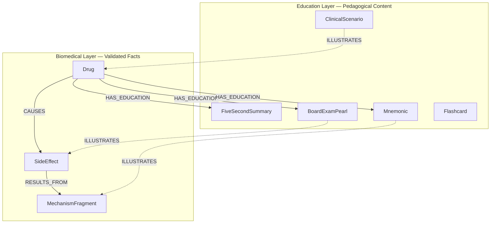
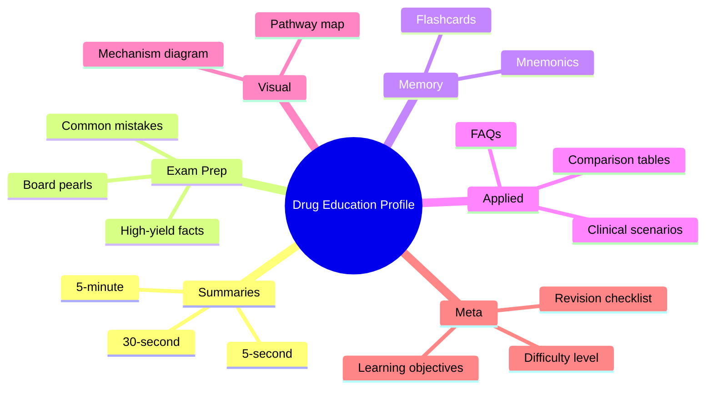
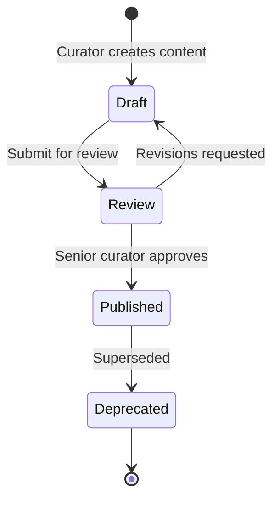

# FarmacoGraph Education Layer

> **Version:** 1.0.0-draft  
> Pedagogical content separated from validated biomedical facts

---

## 1. Purpose

FarmacoGraph serves medical students. Educational content — summaries, mnemonics, exam pearls, flashcards — is essential but must **never be confused with biomedical assertions**.

The education layer is a parallel graph overlay linked to drugs and biomedical entities via explicit, typed relationships.

---

## 2. Layer Separation



### Rules

1. Educational nodes carry `content_layer: "education"` always
2. Educational nodes **cannot** be source or target of clinical relationship types (`TREATS`, `CAUSES`, `INHIBITS`, etc.)
3. `ILLUSTRATES` edges are directional: Education → Biomedical (never the reverse)
4. API responses flag layer explicitly: `"layer": "education" | "biomedical"`
5. AI pipeline treats education content as **supplementary narrative**, never as evidence

---

## 3. Content Types

### 3.1 Tiered summaries

| Type | Target length | Use case |
|------|--------------|----------|
| `FiveSecondSummary` | ≤280 characters | Rapid recall, spaced repetition |
| `ThirtySecondSummary` | ≤800 characters | Oral exam / viva |
| `FiveMinuteExplanation` | Structured sections | Deep understanding session |

**FiveMinuteExplanation sections:**

```yaml
sections:
  - title: Mechanism of Action
    content: string
    linked_fragments: UUID[]    # MechanismFragment IDs
  - title: Clinical Use
    content: string
    linked_diseases: UUID[]
  - title: Key Side Effects
    content: string
    linked_side_effects: UUID[]
  - title: High-Yield Pearls
    content: string
```

### 3.2 Exam preparation

| Type | Fields |
|------|--------|
| `BoardExamPearl` | `text`, `exam_tags[]` (USMLE_Step1, USMLE_Step2, TUS, PLAB) |
| `HighYieldFact` | `text`, `tags[]`, `frequency_rank` |
| `CommonMistake` | `mistake`, `correction`, `why_wrong` |
| `RevisionChecklist` | `items[]`, `module` |

### 3.3 Memory aids

| Type | Fields | Note |
|------|--------|------|
| `Mnemonic` | `mnemonic`, `expansion` | Always labeled non-factual |
| `Flashcard` | `front`, `back`, `hint` | Links to biomedical nodes on back |

### 3.4 Applied learning

| Type | Fields |
|------|--------|
| `ClinicalScenario` | `stem`, `vitals`, `labs`, `questions[]`, `answers[]`, `teaching_points[]` |
| `FAQ` | `question`, `answer`, `related_drugs[]` |
| `ComparisonTable` | `title`, `drug_ids[]`, `columns[]`, `rows[]` |

### 3.5 Visual & structured

| Type | Fields |
|------|--------|
| `VisualExplanation` | `format` (mermaid \| react_flow), `spec` (JSON), `caption` |
| `LearningObjective` | `objective`, `bloom_level` (remember \| understand \| apply \| analyze) |

---

## 4. Metadata Schema

All education entities share:

```yaml
EducationEntity:
  id: UUID
  slug: string
  content_layer: education          # Immutable
  audience: string[]                # MBBS | USMLE | TUS | resident
  difficulty_level: beginner | intermediate | advanced
  language: string                  # Default: en
  created_at: datetime
  updated_at: datetime
  curator_id: string
  reviewed_at: datetime | null
  status: draft | reviewed | published
  linked_entity_ids: UUID[]         # Biomedical nodes illustrated
  module: string | null             # cardiovascular | endocrine | ...
```

---

## 5. Drug Education Profile

A published drug should eventually include a complete education profile:



**Publish requirement for education:** Optional per drug, but module completion criteria require ≥80% of module drugs to have at least `FiveSecondSummary` + `BoardExamPearl`.

---

## 6. API Access Patterns

| Endpoint | Returns |
|----------|---------|
| `GET /drugs/{id}/education` | All published education nodes for drug — MVP live |
| `GET /curator/drugs/{slug}/education` | Draft education nodes from the curator package — MVP live |
| `GET /drugs/{id}/education/summaries` | Tiered summaries only — planned |
| `GET /drugs/{id}/education/flashcards` | Flashcards for export — planned |
| `GET /education/{id}` | Single education entity — planned |
| `POST /compare` | Includes optional `include_education: true` |

Response always includes `"content_layer": "education"`.

---

## 7. Anki / Spaced Repetition Export (Future)

Flashcards and HighYieldFacts export to:

```yaml
anki_card:
  front: string
  back: string
  tags: [farmacograph, module_cardiovascular, drug_metoprolol]
  source_url: string              # Link back to graph entity
  evidence_refs: string[]         # Optional biomedical backing
```

Mnemonics export with tag `mnemonic_non_factual` to prevent clinical confusion.

---

## 8. AI Pipeline Treatment

| Content layer | AI behavior |
|--------------|-------------|
| Biomedical | Primary source for factual answers |
| Education | Supplementary explanation style only |
| Mnemonic | Never cited as clinical evidence |
| ClinicalScenario | Teaching context only — not guideline |

Citation builder excludes education nodes from `evidence_level` scoring.

---

## 9. Curation Workflow



Workflow state stored in PostgreSQL `curator_workflow`; content stored in Neo4j.

---

## 10. Example: Metformin Education Links

```text
(Drug:metformin)-[:HAS_EDUCATION]->(FiveSecondSummary:"Biguanide; activates AMPK; ↓ hepatic glucose")
(Drug:metformin)-[:HAS_EDUCATION]->(Mnemonic:"METFORMIN = Makes Energy Transfer...")
(FiveSecondSummary)-[:ILLUSTRATES]->(MechanismFragment:AMPK Activation)
(Mnemonic)-[:ILLUSTRATES]->(MechanismFragment:AMPK Activation)
```

The mnemonic **illustrates** the fragment; it does not **assert** it.
