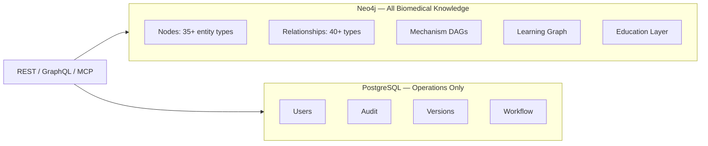
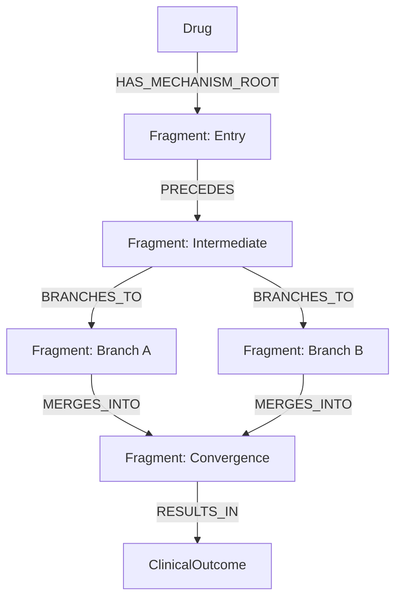
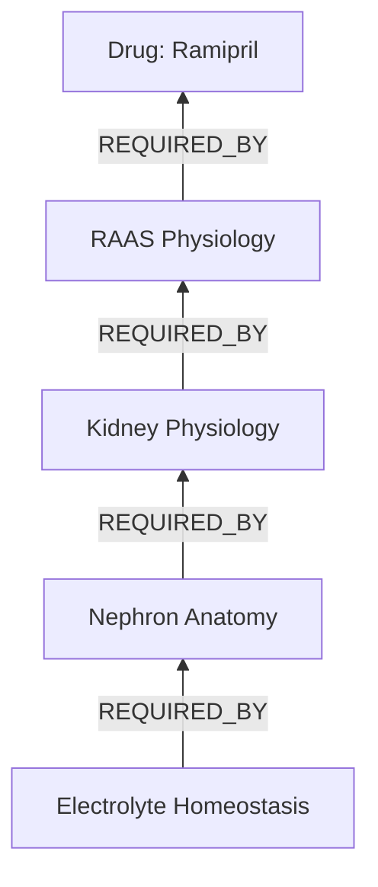

# Graph Specification

> **Version:** 1.0.0 | Neo4j canonical knowledge store

## Storage Architecture



**FG-C030:** PostgreSQL must never store biomedical entity tables.

## Node Label Registry

| Label | Parent | Indexes |
|-------|--------|---------|
| `BiomedicalEntity` | — | `id`, `slug`, `status`, `dataset_version` |
| `Drug` | PharmacologicEntity | `generic_name`, `rxnorm`, `atc` |
| `MechanismFragment` | MechanisticEntity | `name`, `is_reusable` |
| `Evidence` | EvidenceEntity | `evidence_type`, `quality_score` |
| `EducationResource` | — | `content_layer`, `module` |
| `KnowledgeTopic` | LearningEntity | `topic_domain` |

## Relationship Property Schema

Every clinical/mechanistic relationship in Neo4j:

```cypher
// Property keys on relationships
{
  explanation: STRING,           // required on publish
  clinical_significance: STRING,
  mechanism_summary: STRING,
  conditions: STRING,
  confidence_score: FLOAT,       // 0.0–1.0
  evidence_level: STRING,        // A|B|C|D|expert_consensus
  supporting_source_count: INT,
  quality_grade: STRING,
  consensus_status: STRING,
  created_at: DATETIME,
  updated_at: DATETIME,
  source: STRING,
  dataset_version: STRING,
  curator_id: STRING,
  status: STRING,
  validation_state: STRING,
  valid_from: DATE,
  valid_to: DATE,
  deprecated: BOOLEAN
}
```

Evidence links are separate `SUPPORTED_BY` edges, not embedded properties.

## Mechanism DAG Specification



### DAG Rules (FG-C003, FG-C015, FG-C017)

1. Subgraph `{PRECEDES, BRANCHES_TO, MERGES_INTO}` is acyclic
2. Every published Drug has ≥1 `HAS_MECHANISM_ROOT`
3. Fragments are reusable across drugs when `is_reusable: true`
4. Orphan fragments fail publish validation

## Learning Graph Specification



- `REQUIRES` edges form a DAG (FG-C007)
- AI tutors traverse upward to find missing prerequisites
- Learning nodes are `KnowledgeTopic` or `Prerequisite` labels

## Neo4j Constraints (Planned)

```cypher
CREATE CONSTRAINT entity_id IF NOT EXISTS FOR (n:BiomedicalEntity) REQUIRE n.id IS UNIQUE;
CREATE CONSTRAINT drug_slug IF NOT EXISTS FOR (d:Drug) REQUIRE d.slug IS UNIQUE;
CREATE INDEX drug_rxnorm IF NOT EXISTS FOR (d:Drug) ON (d.rxnorm);
CREATE INDEX entity_status IF NOT EXISTS FOR (n:BiomedicalEntity) ON (n.status);
CREATE INDEX entity_version IF NOT EXISTS FOR (n:BiomedicalEntity) ON (n.dataset_version);
```

## Export Formats

| Format | Use case |
|--------|----------|
| Neo4j native | Production |
| JSON graph projection | API, backups |
| React Flow JSON | Web visualization |
| Cytoscape JSON | Network analysis |
| GraphML | Desktop tools |
| Mermaid | Documentation |

## Version Query Pattern

```cypher
MATCH (d:Drug {slug: $slug})-[r:TREATS]->(dis:Disease)
WHERE r.valid_from <= date($as_of)
  AND (r.valid_to IS NULL OR r.valid_to > date($as_of))
  AND r.status = 'published'
RETURN d, r, dis
```
