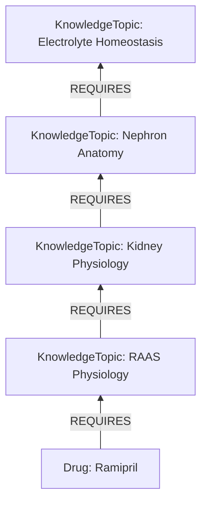
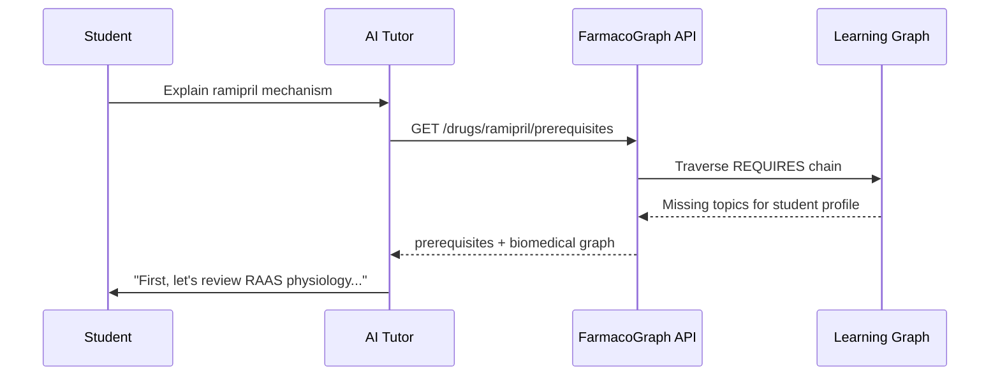

# Learning Graph

> **Version:** 1.0.0 | Prerequisite knowledge for AI tutors

## Purpose

The learning graph answers: **"What does a student need to understand before they can understand this drug?"**

It is separate from the biomedical fact graph and the education content layer.

## Entity Types

| Type | Description |
|------|-------------|
| `KnowledgeTopic` | A learnable concept (physiology, anatomy, biochemistry) |
| `Prerequisite` | Explicit prerequisite link with rationale |

## Relationship

| Type | Semantics |
|------|-----------|
| `REQUIRES` | Source cannot be fully understood without target prerequisite |

### Rules (FG-C007)

- `REQUIRES` forms a **DAG** — no cycles
- Topics can be shared across drugs and modules
- Cross-module links supported (Ramipril → RAAS from PhysioGraph future module)

## AI Tutor Integration

### Prerequisite detection algorithm

1. Fetch `REQUIRES` chain from drug to root topics
2. Compare against student's `completed_topics[]` (from PostgreSQL user profile)
3. Return `missing_topics[]` ordered by dependency depth
4. Tutor addresses gaps before explaining drug mechanism

## API

| Endpoint | Description |
|----------|-------------|
| `GET /drugs/{id}/prerequisites` | Full prerequisite tree |
| `GET /drugs/{drug_ref}/study` | Student payload: drug identity, education layer, flashcards, prerequisites, study plan |
| `GET /learning/topics` | List knowledge topics |
| `GET /learning/topics/{id}` | Topic detail with dependents |
| `GET /explain?question_type=prerequisite` | Missing knowledge for student |

## Content Layer

Learning graph nodes carry `content_layer: learning`. They:

- Do **not** assert biomedical facts
- Link to education content via `HAS_EDUCATION` on topics
- May `ILLUSTRATE` biomedical entities when explaining connections

## Example Topic Domains

| Domain | Example topics |
|--------|---------------|
| Anatomy | Nephron anatomy, cardiac conduction system |
| Physiology | RAAS, insulin signaling, coagulation cascade |
| Biochemistry | CYP metabolism, G-protein signaling |
| Pathology | Heart failure pathophysiology |
| Pharmacology | Receptor pharmacology, PK principles |

## Cross-Module Vision

| Module | Provides topics |
|--------|----------------|
| PhysioGraph | RAAS, insulin signaling, coagulation |
| AnatoGraph | Nephron, cardiac anatomy |
| PathoGraph | Disease pathophysiology prerequisites |
| FarmacoGraph | Drug-specific REQUIRES links |

All use shared `KnowledgeTopic` entity from `fgcore` ontology.
