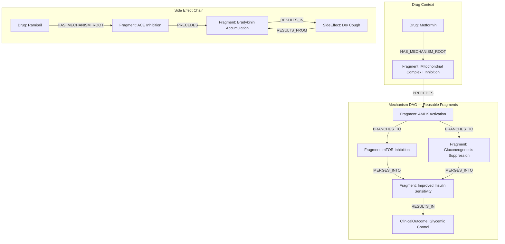
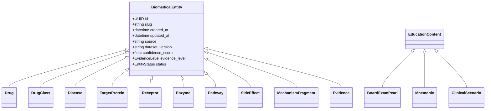
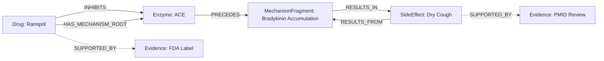

# FarmacoGraph Ontology Specification

> **Version:** 1.0.0-draft  
> **Status:** Canonical semantics — must be defined before database implementation

This document defines the biomedical ontology for FarmacoGraph: entity types, relationship types, constraints, and cross-module compatibility.

---

## 1. Ontology Design Principles

1. **Clear semantics** — every relationship type has a single, documented meaning
2. **No duplication** — entities are unique; relationships express all connections
3. **Evidence-backed** — clinical assertions link to `Evidence` nodes
4. **Versioned** — all nodes and edges support temporal validity
5. **Layered** — biomedical facts and educational content use separate node labels
6. **Extensible** — new relationship types register in the ontology without breaking existing queries
7. **Ecosystem-compatible** — core primitives shared with future *Graph modules

---

## 2. Namespace & Identifiers

```
Base URI:     https://farmacograph.org/ontology/
Entity prefix: fg:
Core prefix:  fgcore:  (shared across ecosystem modules)
```

### Internal ID format

```
{entity_type}:{uuid_v4}
Example: drug:8f3c2a1b-4d5e-6f7a-8b9c-0d1e2f3a4b5c
```

### External ID registry (properties on entities)

| Vocabulary | Property key | Example |
|------------|-------------|---------|
| ATC | `atc` | `C09AA05` |
| RxNorm | `rxnorm` | `35296` |
| ICD-10 | `icd10` | `E11.9` |
| LOINC | `loinc` | `2345-7` |
| MeSH | `mesh` | `D008687` |
| PubChem | `pubchem` | `5362129` |
| UniProt | `uniprot` | `P12821` |
| KEGG | `kegg` | `hsa04151` |
| Reactome | `reactome` | `R-HSA-163359` |
| DrugBank | `drugbank` | `DB00177` (where license permits) |
| SNOMED CT | `snomed` | *(optional plugin)* |
| MedDRA | `meddra` | *(optional plugin)* |

---

## 3. Entity Types (Node Labels)

### 3.1 Pharmacologic entities

| Label | Description | Key properties |
|-------|-------------|----------------|
| `Drug` | A pharmacologic agent | `slug`, `generic_name`, `atc[]`, `rxnorm` |
| `DrugClass` | Therapeutic/pharmacologic class | `name`, `atc_prefix`, `parent_class_id` |
| `TradeName` | Proprietary name | `name`, `manufacturer`, `region` |
| `Dose` | Dosing regimen | `amount`, `unit`, `route`, `frequency`, `population` |

### 3.2 Molecular entities

| Label | Description | Key properties |
|-------|-------------|----------------|
| `TargetProtein` | Molecular drug target | `name`, `uniprot`, `gene_symbol` |
| `Receptor` | Receptor subtype | `name`, `family`, `subtype` |
| `Enzyme` | Metabolic enzyme | `name`, `ec_number`, `is_cyp`, `cyp_family` |
| `Transporter` | Membrane transporter | `name`, `type` (uptake/efflux) |
| `Pathway` | Signaling/metabolic pathway | `name`, `kegg`, `reactome` |

### 3.3 Physiologic entities

| Label | Description | Key properties |
|-------|-------------|----------------|
| `PhysiologicalProcess` | Biological process | `name`, `mesh`, `direction` |
| `Organ` | Anatomical organ | `name`, `system` |
| `CellType` | Relevant cell type | `name`, `organ_id` |

### 3.4 Clinical entities

| Label | Description | Key properties |
|-------|-------------|----------------|
| `Disease` | Disease/condition | `name`, `icd10`, `mesh` |
| `SideEffect` | Adverse effect | `name`, `frequency`, `severity` |
| `Contraindication` | Contraindicated condition | `type` (absolute/relative), `rationale` |
| `Interaction` | Drug-drug/food interaction | `severity`, `mechanism`, `management` |
| `LaboratoryTest` | Lab monitoring test | `name`, `loinc`, `direction_of_change` |
| `Microorganism` | Pathogen | `name`, `gram_stain`, `species` |
| `PregnancyRisk` | Pregnancy/lactation profile | `fda_category`, `pllr_narrative` |
| `MonitoringPlan` | Monitoring protocol | `parameter`, `frequency`, `rationale` |

### 3.5 Mechanistic entities

| Label | Description | Key properties |
|-------|-------------|----------------|
| `MechanismFragment` | Reusable DAG node | `name`, `description`, `is_reusable` |
| `MechanismStep` | Drug-specific mechanism instance | `order_hint`, `fragment_id` |
| `ClinicalOutcome` | Terminal clinical result | `name`, `outcome_type` |

### 3.6 Evidence entities

| Label | Description | Key properties |
|-------|-------------|----------------|
| `Evidence` | Evidentiary support for a claim | `evidence_type`, `quality_score`, `extract` |
| `Reference` | Citable source | `pmid`, `doi`, `url`, `title`, `year` |
| `Guideline` | Clinical guideline | `source` (NICE/WHO/FDA), `year`, `url` |

### 3.7 Educational entities (separate layer)

| Label | Description |
|-------|-------------|
| `FiveSecondSummary` | Ultra-brief recall |
| `ThirtySecondSummary` | Short viva answer |
| `FiveMinuteExplanation` | In-depth student explanation |
| `BoardExamPearl` | Exam high-yield fact |
| `CommonMistake` | Typical error |
| `HighYieldFact` | Spaced-repetition tagged |
| `Mnemonic` | Memory aid |
| `ClinicalScenario` | Case-based scenario |
| `Flashcard` | Front/back card |
| `FAQ` | Question and answer |
| `ComparisonTable` | Multi-drug comparison |
| `VisualExplanation` | Diagram specification |
| `LearningObjective` | Learning goal |
| `RevisionChecklist` | Review checklist |

All educational nodes carry: `content_layer: "education"`, `difficulty_level`, `audience[]`.

---

## 4. Relationship Types

### 4.1 Taxonomic relationships

| Relationship | Domain → Range | Semantics |
|-------------|----------------|-----------|
| `IS_A` | Drug → DrugClass | Drug is a member of pharmacologic class |
| `IS_A` | DrugClass → DrugClass | Class hierarchy (ACEi IS_A Antihypertensive) |
| `BELONGS_TO` | Drug → DrugClass | Synonym for IS_A where class is organizational |
| `PART_OF` | Pathway → Pathway | Pathway hierarchy |
| `PART_OF` | Organ → OrganSystem | Anatomical hierarchy |

### 4.2 Pharmacodynamic relationships

| Relationship | Domain → Range | Semantics |
|-------------|----------------|-----------|
| `TARGETS` | Drug → TargetProtein | Drug acts on molecular target |
| `BINDS_TO` | Drug → Receptor | Receptor binding (agonist/antagonist in metadata) |
| `INHIBITS` | Drug → Enzyme/Receptor/Pathway | Functional inhibition |
| `ACTIVATES` | Drug → Receptor/Pathway | Functional activation |
| `INDUCES` | Drug → Enzyme | Enzyme induction (e.g., CYP) |
| `AFFECTS` | Drug → Pathway | Modulates pathway (direction in metadata) |
| `REGULATES` | Pathway → PhysiologicalProcess | Pathway controls process |

### 4.3 Pharmacokinetic relationships

| Relationship | Domain → Range | Semantics |
|-------------|----------------|-----------|
| `METABOLIZED_BY` | Drug → Enzyme | Primary metabolic route |
| `TRANSPORTED_BY` | Drug → Transporter | Transporter-mediated movement |
| `EXCRETED_VIA` | Drug → Organ/Process | Elimination route |

### 4.4 Clinical relationships

| Relationship | Domain → Range | Semantics |
|-------------|----------------|-----------|
| `TREATS` | Drug → Disease | Therapeutic indication |
| `PREVENTS` | Drug → Disease | Prophylactic use |
| `CAUSES` | Drug → SideEffect | Adverse effect |
| `CONTRAINDICATED_IN` | Drug → Disease/Condition | Must not use |
| `INTERACTS_WITH` | Drug → Drug | Drug-drug interaction (symmetric) |
| `AVOID_WITH` | Drug → Drug/Substance | Stronger avoidance than interaction |
| `MONITOR_WITH` | Drug → LaboratoryTest | Required monitoring |
| `COVERS` | Drug → Microorganism | Antimicrobial spectrum |
| `FIRST_LINE_FOR` | Drug → Disease | Guideline first-line |
| `SECOND_LINE_FOR` | Drug → Disease | Guideline second-line |
| `ALTERNATIVE_TO` | Drug → Drug | Therapeutic substitute |
| `AFFECTS` | Disease → Organ | Disease impacts organ (PathoGraph) |
| `RESULTS_FROM` | SideEffect → MechanismFragment | Side effect mechanistic origin |

### 4.5 Mechanism DAG relationships

| Relationship | Domain → Range | Semantics |
|-------------|----------------|-----------|
| `HAS_MECHANISM_ROOT` | Drug → MechanismFragment | Entry point of drug mechanism DAG |
| `PRECEDES` | MechanismFragment → MechanismFragment | Strict temporal/causal ordering |
| `BRANCHES_TO` | MechanismFragment → MechanismFragment | Parallel downstream paths |
| `MERGES_INTO` | MechanismFragment → MechanismFragment | Converging inputs |
| `MODULATES` | MechanismFragment → PhysiologicalProcess | Process modulation |
| `RESULTS_IN` | MechanismFragment → ClinicalOutcome | Terminal clinical effect |

### 4.6 Evidence relationships

| Relationship | Domain → Range | Semantics |
|-------------|----------------|-----------|
| `SUPPORTED_BY` | Any clinical edge → Evidence | Evidence supports this assertion |
| `CITES` | Evidence → Reference | Bibliographic citation |
| `RECOMMENDED_BY` | Drug → Guideline | Guideline recommendation |
| `DERIVED_FROM` | Evidence → Guideline | Evidence sourced from guideline |

### 4.7 Educational relationships

| Relationship | Domain → Range | Semantics |
|-------------|----------------|-----------|
| `HAS_EDUCATION` | Drug → EducationNode | Links drug to pedagogical content |
| `ILLUSTRATES` | EducationNode → BiomedicalNode | Content illustrates (not asserts) fact |
| `COMPARES` | ComparisonTable → Drug | Multi-drug comparison membership |

### 4.8 Dosing & special population relationships

| Relationship | Domain → Range | Semantics |
|-------------|----------------|-----------|
| `HAS_DOSE` | Drug → Dose | Standard dosing regimen |
| `HAS_PREGNANCY_PROFILE` | Drug → PregnancyRisk | Pregnancy/lactation info |
| `REQUIRES_MONITORING` | Drug → MonitoringPlan | Monitoring protocol |
| `REQUIRES_RENAL_ADJUSTMENT` | Drug → Dose | Renal dose modification |
| `REQUIRES_HEPATIC_ADJUSTMENT` | Drug → Dose | Hepatic dose modification |
| `HAS_TRADE_NAME` | Drug → TradeName | Brand name |

---

## 5. Relationship Metadata Envelope

Every clinical and mechanistic relationship MUST support this property schema:

```yaml
# Neo4j relationship properties
explanation: string              # Required on publish
clinical_significance: string    # Recommended
mechanism_summary: string        # For mechanistic edges
conditions: string                 # Qualifiers (e.g., "at high doses", "in renal impairment")
action_type: enum                # inhibits | activates | binds | unknown
strength: enum                   # strong | moderate | weak | unknown
confidence_score: float          # 0.0–1.0
evidence_level: enum             # A | B | C | D | expert_consensus
created_at: datetime
updated_at: datetime
source: string
dataset_version: string
curator_id: string
status: enum                     # draft | validated | published | deprecated
validation_state: enum
valid_from: date
valid_to: date | null
deprecated: boolean
```

Evidence links are modeled as separate `SUPPORTED_BY` edges to `Evidence` nodes, not embedded in properties.

---

## 6. Ontology Constraints

### 6.1 Structural constraints

| ID | Constraint |
|----|-----------|
| C-001 | `IS_A` and `PART_OF` form DAGs (no cycles) |
| C-002 | Mechanism subgraph reachable from `HAS_MECHANISM_ROOT` is acyclic |
| C-003 | `INTERACTS_WITH` is symmetric: if A→B exists, B→A must exist with identical metadata |
| C-004 | No `Drug` may `INTERACTS_WITH` itself |
| C-005 | Published `CAUSES` must have `RESULTS_FROM` path to MechanismFragment OR explicit `mechanism_summary` |
| C-006 | Published clinical edges require ≥1 `SUPPORTED_BY` → Evidence |
| C-007 | Educational nodes must not be targets of clinical relationship types |
| C-008 | `FIRST_LINE_FOR` and `SECOND_LINE_FOR` require `RECOMMENDED_BY` or `SUPPORTED_BY` link |

### 6.2 Cardinality guidelines

| Relationship | Cardinality |
|-------------|-------------|
| Drug IS_A DrugClass | ≥1 |
| Drug HAS_MECHANISM_ROOT | ≥1 for published drugs |
| Drug TREATS Disease | ≥1 for published drugs |
| Drug METABOLIZED_BY Enzyme | 0..n |
| Drug CAUSES SideEffect | 0..n (common ADRs expected for published drugs) |

---

## 7. Mechanism DAG Ontology



### Fragment reuse

When Ramipril and Enalapril share "ACE Inhibition" → "Bradykinin Accumulation", they link to the **same** `MechanismFragment` nodes. Drug-specific context is only on `HAS_MECHANISM_ROOT`.

---

## 8. Ontology Class Hierarchy



---

## 9. Cross-Module Ontology Alignment

Shared `fgcore:` primitives used by all ecosystem modules:

| Primitive | Used by |
|-----------|---------|
| `BiomedicalEntity` base | All modules |
| `Evidence` + `Reference` | All modules |
| `VersioningMetadata` | All modules |
| `RelationshipMetadataEnvelope` | All modules |
| `EducationContent` pattern | All modules |
| `Organ`, `Disease`, `LaboratoryTest` | Shared clinical entities |

FarmacoGraph-specific extensions:

| Extension | Module |
|-----------|--------|
| `Drug`, `DrugClass`, `Interaction` | FarmacoGraph |
| `COVERS` (Microorganism) | FarmacoGraph ↔ MicroGraph |
| `METABOLIZED_BY` (CYP) | FarmacoGraph |

---

## 10. OWL Authoring Plan

Files to be created in `ontology/` before implementation:

| File | Contents |
|------|----------|
| `farmacograph-core.ttl` | Classes, object properties, data properties |
| `relationships.json` | Machine-readable relationship registry |
| `constraints.shacl` | SHACL validation shapes (Phase 2) |

The JSON relationship registry is the **runtime source of truth** for validators and API; OWL/Turtle is the **formal semantic specification**.

---

## 11. Example: Ramipril Cough Explanation



**Traversal query intent:** `Drug(ramipril) → mechanism DAG → SideEffect(cough)` with evidence at each hop.

---

## 12. Glossary

| Term | Definition |
|------|------------|
| **Assertion** | A published relationship between two biomedical entities |
| **Fragment** | Reusable mechanism DAG node |
| **Layer** | Biomedical (factual) vs Education (pedagogical) |
| **Publish** | Promote entity from validated to published status |
| **Projection** | API/graph export view of a subgraph |
