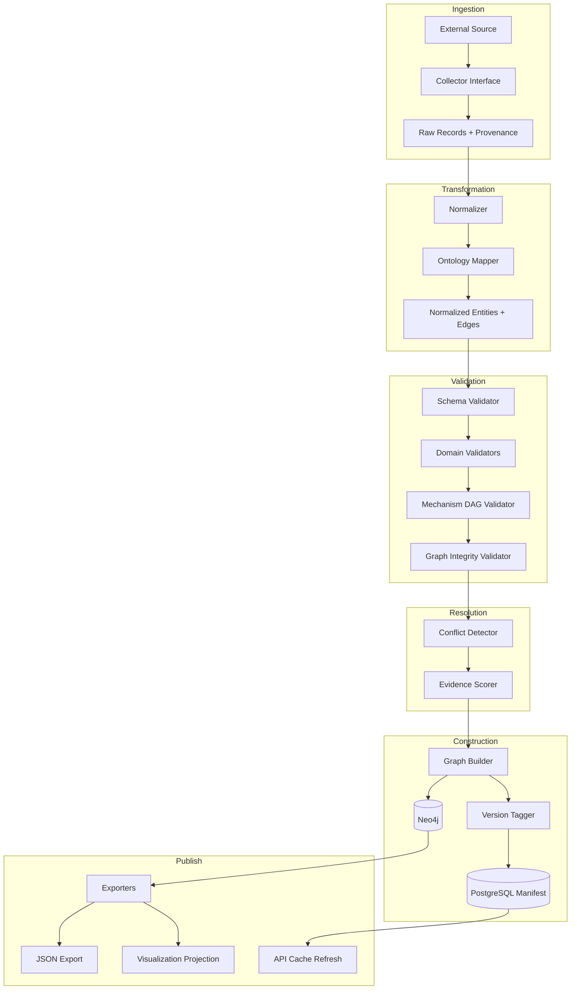
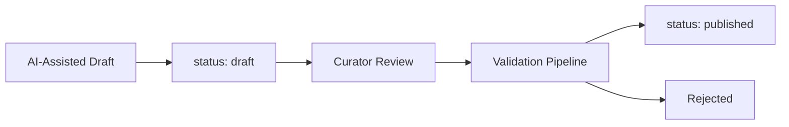

# FarmacoGraph Data Pipeline

> **Version:** 1.0.0-draft  
> Ingestion, validation, evidence scoring, and graph construction

---

## 1. Pipeline Overview



---

## 2. Stage Specifications

### Stage 1: Collection (interfaces only — Phase 1)

**Input:** Source configuration  
**Output:** `CollectorResult`

```yaml
CollectorResult:
  source: DataSource
  fetched_at: datetime
  raw_records: object[]
  provenance:
    source_url: string
    fetch_method: api | file | scrape
    license_note: string
```

**Planned collector interfaces (no implementation yet):**

- DrugBank, DailyMed, PubChem, KEGG, Reactome, OpenTargets
- ChEMBL, RxNorm, WHO Essential Medicines
- FDA Labels, EMA SmPC, NICE, BNF, PubMed

**Rule:** Collectors write to object store (raw snapshots); they never write directly to Neo4j.

---

### Stage 2: Normalization

**Input:** Raw records  
**Output:** `NormalizedEntity[]` + `NormalizedEdge[]`

Responsibilities:

- Map source-specific field names to ontology properties
- Resolve external IDs (RxNorm, ATC, UniProt)
- Split embedded lists into entity references
- Assign `source` and initial `status: draft`

---

### Stage 3: Ontology Mapping

**Input:** Normalized records  
**Output:** Ontology-aligned entities

Responsibilities:

- Create-or-link: if `Enzyme:CYP3A4` exists, link rather than duplicate
- Map source drug classes to `DrugClass` hierarchy
- Attach mechanism data as DAG fragments, not linear lists
- Separate education content if present in source

---

### Stage 4: Schema Validation

**Input:** Normalized entities  
**Output:** Pass / Fail per entity

Validates:

- Pydantic model compliance
- Required fields per entity type and status
- External ID format (ATC pattern, LOINC pattern)
- Enum value validity

**Fail behavior:** Reject entity; log to validation report.

---

### Stage 5: Domain Validation

| Validator | Checks |
|-----------|--------|
| `RequiredFieldsValidator` | Published drugs: name, ATC, ≥1 TREATS, ≥1 reference path |
| `DuplicateEntityValidator` | Same external ID or fuzzy name collision |
| `ATCConsistencyValidator` | ATC prefix matches DrugClass |
| `DrugClassConsistencyValidator` | IS_A hierarchy valid |
| `TargetConsistencyValidator` | Class-expected targets (ACEi → ACE) |
| `InteractionConsistencyValidator` | Symmetric, no self-interaction, severity enum |
| `PregnancyConsistencyValidator` | Category aligns with CONTRAINDICATED_IN |
| `RenalDosingValidator` | eGFR thresholds monotonic |
| `HepaticDosingValidator` | Child-Pugh categories valid |
| `ReferenceCompletenessValidator` | Published edges have SUPPORTED_BY |
| `EducationSeparationValidator` | No clinical edges to/from education nodes |

---

### Stage 6: Mechanism DAG Validation

| Check | Rule |
|-------|------|
| Acyclicity | No cycles in mechanism subgraph |
| Reachability | All fragments reachable from HAS_MECHANISM_ROOT |
| Terminal nodes | Every leaf has RESULTS_IN or MODULATES |
| Orphan fragments | No unpublished orphan fragments |
| Reuse integrity | Shared fragments have consistent properties |

---

### Stage 7: Graph Integrity Validation

| Check | Rule |
|-------|------|
| Broken links | All relationship targets exist |
| IS_A cycles | No cycles in taxonomic hierarchies |
| INTERACTS_WITH symmetry | Bidirectional pairs match |
| Status consistency | Published entities have passed validation |
| Version consistency | All entities in batch share dataset_version |

---

### Stage 8: Conflict Detection

**Input:** Validated batch + existing graph  
**Output:** `Conflict[]` → PostgreSQL curator queue

Conflict types:

| Type | Example |
|------|---------|
| `property_mismatch` | DrugBank vs FDA label half-life disagreement |
| `relationship_conflict` | Source A: TREATS; Source B: CONTRAINDICATED_IN same disease |
| `duplicate_entity` | Two nodes for same RxNorm ID |
| `evidence_contradiction` | RCT vs expert consensus disagreement |

**Behavior:** Conflicts do not block draft ingestion; they block **publish** until resolved.

---

### Stage 9: Evidence Scoring

**Input:** Entity/edge + linked Evidence nodes  
**Output:** `confidence_score` on entity/edge

Scoring factors:

| Factor | Weight |
|--------|--------|
| Evidence type (RCT > review > consensus) | High |
| Recency | Medium |
| Source authority (FDA label, NICE) | High |
| Multiple independent sources | Medium |
| Curator attestation | Override |

---

### Stage 10: Graph Building

**Input:** Scored, validated entities  
**Output:** Neo4j transaction

Operations:

- `MERGE` entities by canonical ID
- Create relationships with full metadata envelope
- Link Evidence via `SUPPORTED_BY`
- Build mechanism DAG edges
- Tag with `dataset_version`

**Atomicity:** Batch commit per module; rollback on any error.

---

### Stage 11: Version Tagging

**Input:** Successful graph build  
**Output:** PostgreSQL `dataset_versions` record

```yaml
DatasetVersion:
  version_tag: string           # CalVer: 2026.1.0
  module: string                # cardiovascular
  released_by: user_id
  entity_count: int
  relationship_count: int
  validation_report_hash: string
  neo4j_snapshot_id: string
  status: staged | published | archived
```

---

### Stage 12: Export & API Refresh

- JSON graph export to `datasets/farmacograph-{version}.json`
- Visualization projections precomputed for common modes
- API cache invalidation in PostgreSQL

---

## 3. AI-Generated Content Policy



- AI output never enters with `status: published`
- `source: ai_assisted_draft` required
- Curator must attest before promotion
- No AI content in Evidence nodes without human verification

---

## 4. Validation Severity

| Severity | Publish behavior |
|----------|-----------------|
| `error` | Block publish |
| `warning` | Allow publish with flag |
| `info` | Log only |

---

## 5. Pipeline CLI Commands (Planned)

```bash
farmacograph pipeline validate --input ./staging/cardiovascular/
farmacograph pipeline build --module cardiovascular --version 2026.1.0
farmacograph pipeline publish --version 2026.1.0 --approve
farmacograph pipeline export --version 2026.1.0 --format json
farmacograph pipeline report --version 2026.1.0
```

---

## 6. Monitoring & Observability

| Metric | Storage |
|--------|---------|
| Pipeline run duration | PostgreSQL + logs |
| Validation error counts | Validation report JSON |
| Entity counts per module | dataset_versions |
| API query latency | api_statistics |
| Curator queue depth | curator_workflow |

---

## 7. Error Handling

| Failure point | Recovery |
|--------------|----------|
| Schema validation | Fix source data; re-run |
| DAG cycle detected | Curator fixes mechanism; re-validate |
| Neo4j commit failure | Rollback batch; no partial publish |
| Conflict on publish | Curator resolves; re-submit |
| Export failure | Graph remains published; retry export |
