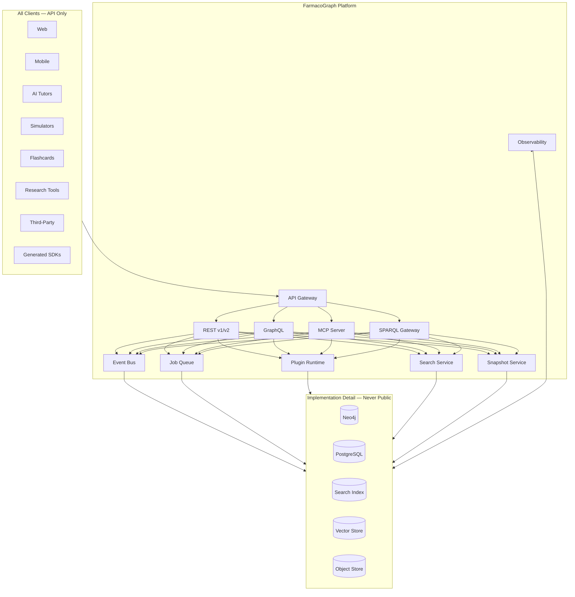
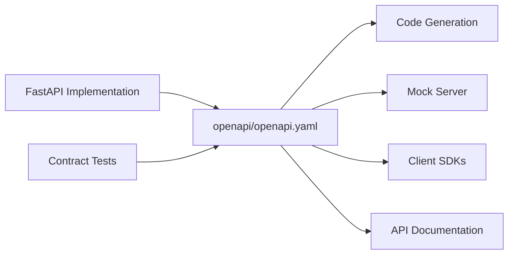
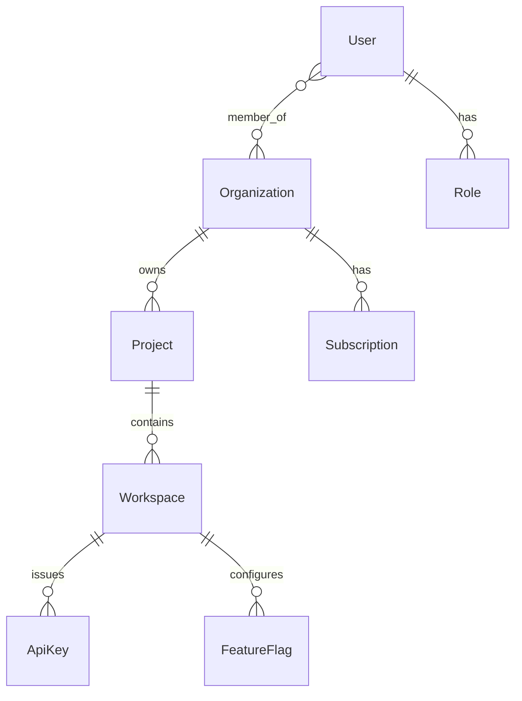
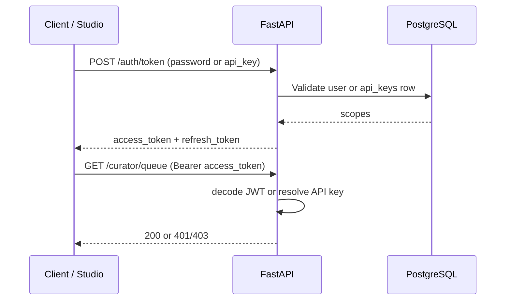
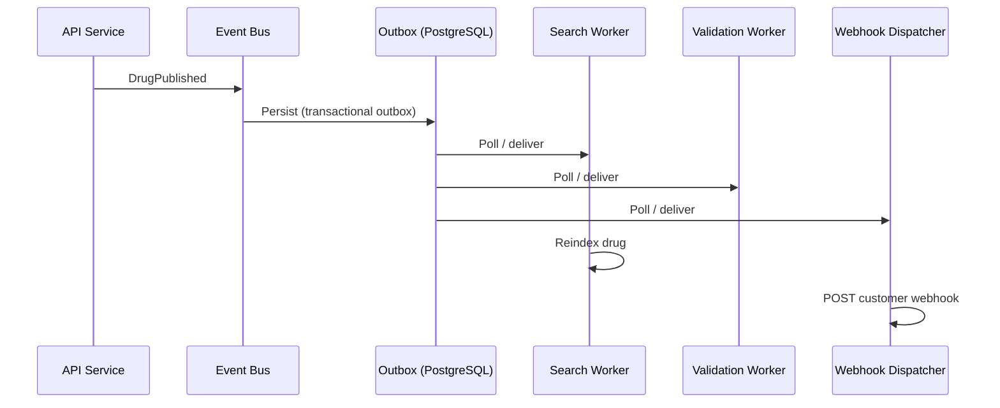
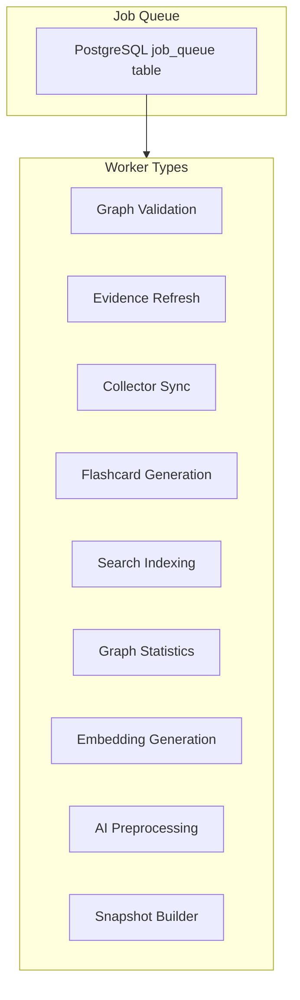
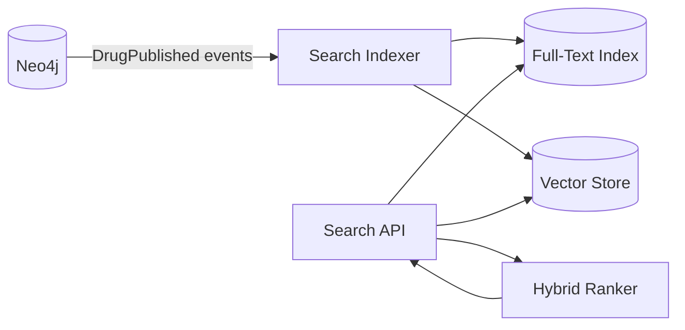
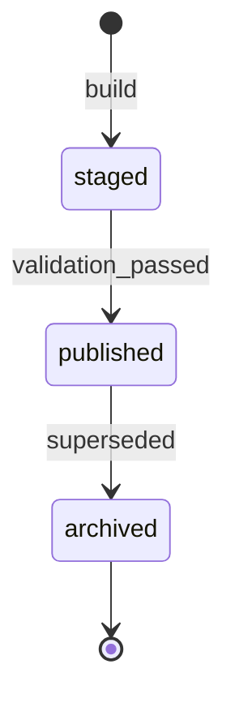
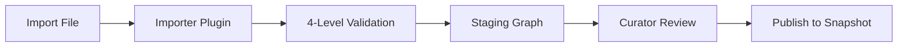
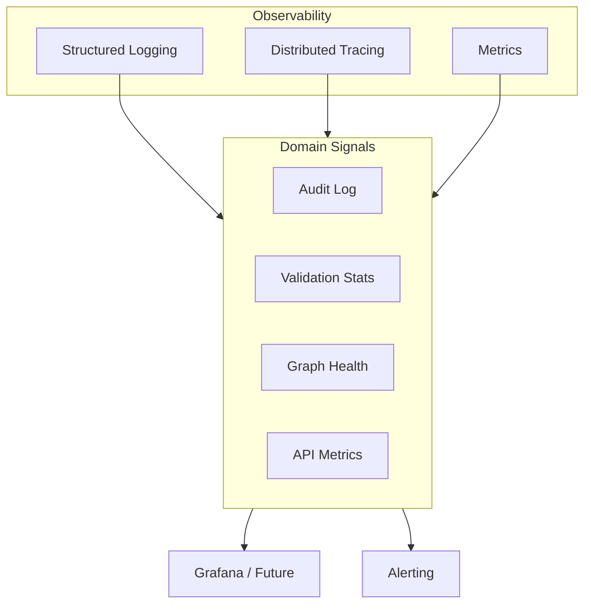

# FarmacoGraph Platform Architecture

> **Version:** 1.1.0  
> **Status:** Approved — prerequisite for Phase 3 infrastructure  
> **Scope:** Platform capabilities, not biomedical entities

FarmacoGraph is a **long-term biomedical knowledge platform**. The database is an implementation detail. The API is the product.

---

## Platform Vision



---

## 1. API-First — Hard Requirement

### Rule

**No client — including first-party applications — may access Neo4j, PostgreSQL, or internal services directly.**

| Layer | Public? | Access |
|-------|---------|--------|
| REST / GraphQL / MCP / SPARQL | **Yes** | All clients |
| Service layer | Internal | API handlers only |
| Neo4j / PostgreSQL | **Never** | Service layer only |

Violations of this rule are architectural defects, not shortcuts.

### API surfaces

| Surface | Phase | Contract |
|---------|-------|----------|
| **REST** | Phase 3 | `openapi/openapi.yaml` |
| **GraphQL** | Phase 4+ | Schema derived from ontology |
| **MCP** | Phase 4+ | Tool definitions for LLM agents |
| **SPARQL** | Phase 5+ | Read-only endpoint over RDF export |
| **SDKs** | Phase 4+ | Generated from OpenAPI (Python, TypeScript) |

### OpenAPI-first development



1. **Spec first** — change OpenAPI before implementation  
2. **Contract tests** — responses validated against spec  
3. **SDK generation** — `openapi-generator` for Python/TypeScript  
4. **Versioning** — URL path (`/api/v1`, `/api/v2`); breaking changes = new major version  

### API stability guarantees

| Guarantee | Description |
|-----------|-------------|
| Versioned endpoints | `/api/v1` stable for 12+ months after v2 launch |
| Deprecation policy | `Sunset` header + 90-day notice |
| Snapshot pinning | `?dataset_version=2027.1.0` on all knowledge queries |
| Content layers | `layers=biomedical,education,learning` |
| Response envelope | Always `{ data, meta }` with version metadata |

See [api-first.md](api-first.md) for endpoint catalog.

---

## 2. Multi-Tenant Ready

Architecture supports future SaaS without redesign. Tenant context flows through every request.

### Tenant model



| Entity | PostgreSQL | Description |
|--------|------------|-------------|
| `Organization` | ✓ | Top-level tenant (university, company) |
| `Project` | ✓ | FarmacoGraph instance or module scope |
| `Workspace` | ✓ | Curator team, student cohort, API consumer |
| `ApiKey` | ✓ | Scoped authentication for integrations |
| `Role` | ✓ | Permission scopes per org/project |

**Neo4j knowledge graph is shared** (open dataset) in default mode. Tenant isolation applies to:

- Curator drafts (workspace-scoped until publish)
- API keys and rate limits
- Usage analytics and billing
- Custom exports and webhooks
- Feature flags (e.g. SNOMED plugin enabled)

### Request context (every API call)

```http
Authorization: Bearer fg_live_...
X-FG-Organization-Id: org_uuid
X-FG-Workspace-Id: ws_uuid
X-FG-Dataset-Version: 2027.1.0
```

### Permission scopes

| Scope | Capability |
|-------|------------|
| `knowledge:read` | Read published knowledge |
| `knowledge:search` | Search and autocomplete |
| `knowledge:explain` | Explain and compare |
| `education:read` | Education layer content |
| `graph:query` | Whitelisted graph templates |
| `curator:write` | Create/edit drafts |
| `curator:publish` | Approve and publish |
| `admin:org` | Organization management |
| `admin:api_keys` | API key management |

### Rate limits

Tracked in PostgreSQL `api_usage` (middleware planned — Phase API 5.3):

| Tier | Requests/min | Burst |
|------|-------------|-------|
| Anonymous | 30 | 50 |
| Authenticated | 300 | 500 |
| API key (standard) | 1000 | 2000 |
| API key (enterprise) | 10000 | 20000 |

### Authentication (implemented — API 5.2)



| Endpoint | Purpose | Status |
|----------|---------|--------|
| `POST /auth/token` | Issue JWT pair (`password` or `api_key` grant) | **Live** |
| `POST /auth/refresh` | Rotate access token | **Live** |
| Bearer validation | JWT decode or API key hash lookup | **Live** |
| `POST /auth/introspect` | JWT/API key scope lookup without full login | **Live** |
| Self-service key management | `admin:api_keys` / `admin:org` CRUD via `/users/{id}/api-keys` | **Live** (Studio `/users`) |

**Security rules:**
- Refresh tokens cannot authenticate API requests (access tokens only).
- Curator scopes reject anonymous callers with `401`.
- Production requires a non-default `FG_JWT_SECRET_KEY` and disables anonymous read.
- Dev curator auto-seeded on empty DB when `FG_SEED_DEV_USERS=true` (`farmacograph/db/postgres/seed.py`).

Implementation: `farmacograph/auth/service.py`, `farmacograph/auth/middleware.py`

---

Events consumed by billing adapter:

- `ModuleReleased`
- `SearchIndexUpdated`
- API usage aggregates (daily rollups)
- Embedding generation volume

No billing logic in core — webhook/plugin only.

### Feature flags

PostgreSQL `feature_flags` per organization/workspace:

```yaml
snomed_terminology: false
semantic_search: true
graphql_api: false
mcp_server: false
custom_snapshots: false
```

---

## 3. Event-Driven Architecture

Domain events decouple subsystems and enable automation.

### Event envelope

Every event shares a standard envelope (see `architecture/events.json`):

```json
{
  "event_id": "uuid",
  "event_type": "DrugPublished",
  "event_version": "1.0.0",
  "occurred_at": "2027-03-15T10:00:00Z",
  "aggregate_type": "Drug",
  "aggregate_id": "uuid",
  "dataset_version": "2027.1.0",
  "tenant_id": null,
  "workspace_id": "uuid",
  "actor_id": "uuid",
  "correlation_id": "uuid",
  "payload": {}
}
```

### Event catalog

| Event | Trigger | Key consumers |
|-------|---------|---------------|
| `DrugPublished` | Drug → published | Search indexer, flashcards, webhooks |
| `DrugDeprecated` | Drug deprecated | Search indexer, analytics |
| `MechanismUpdated` | DAG change | Graph validator, viz cache, embeddings |
| `EvidenceAdded` | New evidence node | Confidence scorer |
| `EvidenceDeprecated` | Evidence retired | Re-validation worker |
| `GuidelineUpdated` | Guideline change | Validation worker |
| `ModuleReleased` | Module complete | Snapshot builder, billing |
| `KnowledgeValidated` | Validation run done | Publish gate, curator UI |
| `KnowledgeSnapshotCreated` | Snapshot registered | CDN, SDK notifier |
| `FlashcardsGenerated` | Flashcard job done | Webhooks, analytics |
| `SearchIndexUpdated` | Index refreshed | Health monitor |
| `CollectorSyncCompleted` | Collector finished | Pipeline orchestrator |
| `EmbeddingBatchCompleted` | Vectors created | Search indexer |

### Event flow



### Transport evolution

| Phase | Transport |
|-------|-----------|
| Phase 3 | In-process bus + PostgreSQL outbox |
| Phase 4 | Dedicated worker processes polling outbox |
| Phase 5 | Redis Streams / NATS (optional scale-out) |

**Rule:** Neo4j never emits events directly to external systems.

---

## 4. Background Job System

Architecture only — no implementation in Phase 3 spec.

### Job categories



| Job type | Priority | Trigger | Timeout |
|----------|----------|---------|---------|
| `graph_validation` | high | Pre-publish, `KnowledgeValidated` | 30m |
| `evidence_refresh` | low | Scheduled, `EvidenceDeprecated` | 60m |
| `collector_sync` | medium | Scheduled, manual | 120m |
| `flashcard_generation` | medium | `DrugPublished`, manual | 15m |
| `search_indexing` | high | `ModuleReleased`, `DrugPublished` | 60m |
| `graph_statistics` | low | Post-snapshot | 10m |
| `embedding_generation` | medium | `ModuleReleased` | 180m |
| `ai_preprocessing` | low | Manual, future | 60m |
| `snapshot_build` | high | `ModuleReleased` | 120m |

### Job record schema (PostgreSQL)

```text
jobs
  id, type, status (pending|running|completed|failed|cancelled),
  priority, payload_json, result_json,
  created_at, started_at, completed_at,
  attempts, max_attempts, error_message,
  correlation_id, workspace_id, created_by
```

### Retry policy

- Exponential backoff: 1m, 5m, 15m, 60m
- Dead letter queue after `max_attempts`
- Idempotent job handlers (safe to retry)

---

## 5. Search Architecture

Search is **separate from graph storage**. Neo4j is optimized for traversal; search is optimized for discovery.



### Search modes

| Mode | Phase | Backend |
|------|-------|---------|
| Full-text | Phase 3 | Meilisearch or PostgreSQL FTS |
| Autocomplete | Phase 3 | Prefix index |
| Synonym expansion | Phase 4 | Synonym dictionary plugin |
| Abbreviation resolution | Phase 4 | Medical abbreviation map (ACEi → ACE inhibitor) |
| Typo tolerance | Phase 3 | Fuzzy matching (Levenshtein) |
| Semantic | Phase 5 | Vector store + embedding provider plugin |
| Hybrid | Phase 5 | Weighted fusion of FTS + semantic |

### Index document schema

```json
{
  "id": "drug:uuid",
  "type": "Drug",
  "label": "Ramipril",
  "synonyms": ["Tritace", "Altace"],
  "abbreviations": ["ACEi"],
  "generic_name": "Ramipril",
  "atc": ["C09AA05"],
  "module": "cardiovascular",
  "content_layer": "biomedical",
  "dataset_version": "2027.1.0",
  "searchable_text": "ramipril ace inhibitor hypertension ...",
  "embedding": [0.1, 0.2, "..."]
}
```

### Ranking signals

| Signal | Weight |
|--------|--------|
| Exact label match | highest |
| Synonym match | high |
| Generic name match | high |
| Abbreviation match | medium |
| Fuzzy match | medium |
| Semantic similarity | context-dependent |
| Published status boost | +10% |
| Module relevance | filter |

### API endpoints

- `GET /search?q=` — live through the configured search provider (Neo4j provider when enabled)
- `GET /search/autocomplete?q=` — prefix suggestions
- `GET /search/suggest?q=` — did-you-mean + abbreviations

The search provider is plugin-oriented. Basic search is live; autocomplete, suggestions, and a dedicated full-text/vector provider remain future work.

---

## 6. Knowledge Snapshots

Immutable, reproducible releases.

### Version naming

CalVer: `{YEAR}.{MINOR}.{PATCH}`

```
FarmacoGraph 2027.1.0  — Cardiovascular module
FarmacoGraph 2027.2.0  — + Endocrinology
FarmacoGraph 2028.1.0  — + Infectious Diseases
```

### Snapshot lifecycle



### Reproducibility manifest

See `architecture/snapshots.schema.json`. Every snapshot includes:

- Neo4j dump SHA-256
- JSON / JSON-LD export SHA-256
- Validation report hash
- Source git tag + pipeline version
- Entity/relationship counts

### Client snapshot pinning

```http
GET /api/v1/drugs/ramipril?dataset_version=2027.1.0
X-FG-Dataset-Version: 2027.1.0
```

Default: latest published. Explicit: pinned version for reproducible research and exams.

---

## 7. Import / Export System

Plugin-based — see `architecture/plugin-interfaces.json`.

### Export formats

| Format | Plugin type | Use case |
|--------|-------------|----------|
| JSON | exporter | API backup, interchange |
| JSON-LD | exporter | Linked data, SPARQL prep |
| CSV | exporter | Spreadsheet analysis |
| OWL/Turtle | exporter | Ontology tools |
| RDF | exporter | Semantic web |
| GraphML | exporter | Cytoscape, Gephi |
| Neo4j dump | exporter | Disaster recovery |
| OpenAPI | built-in | API contract export |
| FHIR | importer/exporter | Future clinical integration (plugin) |

### Import pipeline



### Export API

```http
POST /api/v1/exports
{
  "format": "json-ld",
  "scope": { "module": "cardiovascular" },
  "dataset_version": "2027.1.0"
}
→ 202 Accepted { "job_id": "..." }
→ GET /api/v1/exports/{job_id}
```

Large exports are **background jobs**, not synchronous responses.

---

## 8. Plugin System

**Everything external is a plugin.** No tight coupling.

### Plugin types

| Type | Examples |
|------|----------|
| `collector` | DrugBank, PubMed, FDA DailyMed |
| `validator` | Custom institutional rules |
| `exporter` | JSON-LD, FHIR |
| `importer` | CSV bulk import |
| `reasoner` | Custom explain paths |
| `search_provider` | Meilisearch, Elasticsearch |
| `llm_provider` | OpenAI, Anthropic, local models |
| `visualization_provider` | React Flow, Cytoscape |
| `terminology_provider` | SNOMED CT, MedDRA |
| `embedding_provider` | OpenAI embeddings, local |

### Discovery

```toml
# pyproject.toml (third-party plugin)
[project.entry-points."farmacograph.plugins"]
drugbank-collector = "my_plugin:DrugBankCollector"
```

### Plugin contract

```python
# Conceptual — not implemented yet
class CollectorPlugin(Protocol):
    name: str
    version: str

    async def fetch(self, config: PluginConfig) -> CollectorResult: ...
    def health_check(self) -> HealthStatus: ...
```

### Isolation rules

1. Plugins use **service layer** — never direct Neo4j in production  
2. Plugins declare `supported_formats` / `supported_entities` explicitly  
3. Failed plugin health check → auto-disable with alert  
4. Untrusted plugins → future sandbox (WASM/subprocess)  

---

## 9. Observability

Platform monitoring from Day One of Phase 3.

### Three pillars



### Logging

- Structured JSON logs (Python `structlog`)
- Correlation ID on every request → propagated to jobs and events
- Log levels: DEBUG (dev), INFO (prod), ERROR (always)
- **Never log** biomedical content at DEBUG in production

### Tracing

- OpenTelemetry spans: `api.request`, `neo4j.query`, `search.query`, `job.execute`
- Trace ID in event envelope and job records

### Metrics (Prometheus-compatible)

| Metric | Type |
|--------|------|
| `fg_api_requests_total` | counter |
| `fg_api_request_duration_seconds` | histogram |
| `fg_neo4j_query_duration_seconds` | histogram |
| `fg_search_queries_total` | counter |
| `fg_jobs_total` by status | counter |
| `fg_validation_errors_total` | counter |
| `fg_snapshot_entity_count` | gauge |
| `fg_plugin_health` | gauge |

### Audit

PostgreSQL `audit_log` — immutable:

- Who changed what, when
- Curator actions (draft, review, publish, deprecate)
- API key usage (aggregated)
- Export/import operations

### Health checks

```http
GET /api/v1/health
```

```json
{
  "status": "ok",
  "checks": {
    "neo4j": "connected",
    "postgresql": "connected",
    "search": "connected",
    "job_queue": "healthy",
    "latest_snapshot": "2027.1.0"
  }
}
```

### Validation statistics

`GET /api/v1/statistics` — entity counts, validation pass rates, module completion, graph density metrics.

---

## Phase 3 Implementation Order

With platform architecture approved:

| Step | Deliverable |
|------|-------------|
| 3.1 | PostgreSQL schema (tenants, jobs, outbox, audit, snapshots) |
| 3.2 | Neo4j constraints + indexes |
| 3.3 | Service layer (no DB in API handlers) |
| 3.4 | FastAPI implementing OpenAPI contract |
| 3.5 | Event bus + outbox table |
| 3.6 | Job queue skeleton |
| 3.7 | Search indexer worker (FTS plugin) |
| 3.8 | Snapshot builder |
| 3.9 | Health + metrics endpoints |
| 3.10 | Contract tests against OpenAPI |

**No pharmacology data until 3.1–3.10 pass review.**

---

## Architecture Decision Log

See [adr/README.md](adr/README.md) for the full ADR index.

| ID | Decision | Rationale |
|----|----------|-----------|
| ADR-010 | API is the only public interface | Platform, not database |
| ADR-011 | Tenant context in PostgreSQL only | Knowledge graph is shared open dataset |
| ADR-012 | Transactional outbox for events | Reliable delivery without Neo4j triggers |
| ADR-013 | Search as separate index | Graph traversal ≠ full-text discovery |
| ADR-014 | Immutable snapshots | Reproducible releases for education/research |
| ADR-015 | Plugin system for all externals | No tight coupling, SaaS extensibility |
| ADR-016 | OpenTelemetry from Phase 3 | Observability is not retrofitted |

---

## Related Documents

| Document | Focus |
|----------|-------|
| [api-first.md](api-first.md) | REST contract and client rules |
| [architecture.md](architecture.md) | Biomedical knowledge architecture |
| [graph-specification.md](graph-specification.md) | Neo4j model |
| [pipeline.md](pipeline.md) | Ingestion and validation |
| `architecture/events.json` | Domain event catalog |
| `architecture/plugin-interfaces.json` | Plugin registry |
| `architecture/snapshots.schema.json` | Snapshot manifest |
