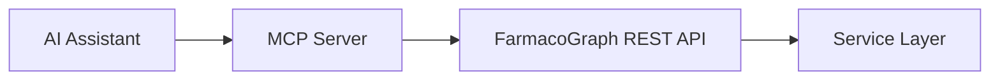

# FarmacoGraph MCP Server (Design)

> Design only. Implementation in Phase 4+.

## Purpose

Expose biomedical knowledge to AI assistants via **Model Context Protocol** without database access.

## Architecture

MCP server is a thin adapter over the public API — never Neo4j.

## Tools

| Tool | API mapping | Description |
|------|-------------|-------------|
| `search_knowledge` | `GET /search` | Find entities by query |
| `get_drug` | `GET /drugs/{id}` | Drug profile with relationships |
| `explain` | `GET /explain` | Mechanism reasoning chain + evidence |
| `compare_drugs` | `POST /compare` | Side-by-side comparison |
| `get_prerequisites` | `GET /drugs/{id}/prerequisites` | Learning graph gaps |
| `get_flashcards` | `GET /flashcards` | Education flashcards |
| `list_modules` | `GET /modules` | Curriculum modules |

## Resources (optional)

| URI | Content |
|-----|---------|
| `farmacograph://drug/{slug}` | Drug summary JSON |
| `farmacograph://snapshot/{version}` | Snapshot manifest |

## Constraints

- Read-only — no write tools
- Every tool response includes `dataset_version` and `evidence_ids`
- Low-confidence results flagged in metadata
- Education content labeled `content_layer: education`

## Authentication

Service API key with scopes: `knowledge:read`, `knowledge:explain`, `knowledge:search`.

## Deployment

Standalone process or sidecar: `farmacograph mcp serve --api-url https://api.farmacograph.org`
