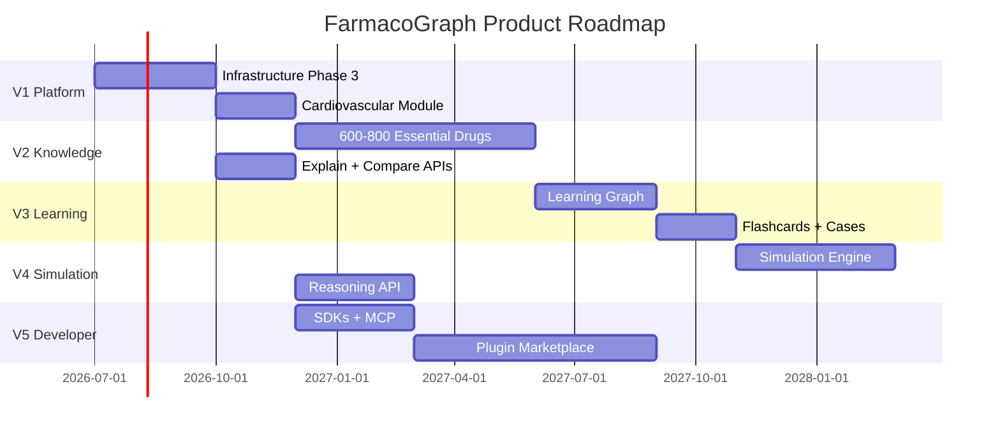

# FarmacoGraph Product Roadmap

> Long-term product milestones. Dependencies shown between versions.

## Version 1 — Core Platform (2026)

**Goal:** Production infrastructure + first complete module.

| Deliverable | Status |
|-------------|--------|
| PostgreSQL ops schema | ✅ Complete |
| Neo4j init + service layer | ✅ Complete |
| FastAPI core endpoints (25 routes) | ✅ Complete |
| Auth (JWT, API key validation, refresh, introspect) | ✅ Complete |
| Event bus + jobs | ✅ Complete |
| CI/CD + Docker Compose | ✅ Complete |
| Curation Studio 4.1 | ✅ Complete |
| Cardiovascular module (~70 drugs) | In progress |

## Version 2 — Essential Pharmacopedia (2027 H1)

**Goal:** 600–800 drugs across all organ-system modules.

| Deliverable | Dependency |
|-------------|------------|
| 10 organ-system modules | V1 platform |
| Explain API (full reasoning chains) | Graph traversal service |
| Comparison API | Graph service |
| Python + TypeScript SDKs | OpenAPI stable |
| Search (full-text) | Meilisearch/FTS plugin (Neo4j provider live) |

## Version 3 — Adaptive Learning (2027 H2)

**Goal:** AI-ready education layer.

| Deliverable | Dependency |
|-------------|------------|
| Learning Graph (prerequisites) | V2 drugs |
| Flashcard API + Anki export | Education layer |
| Clinical case API | Education + graph |
| Adaptive path API (future) | Learning graph + user profiles |

## Version 4 — Clinical Simulation (2028)

**Goal:** Real-time explainable knowledge for simulators.

| Deliverable | Dependency |
|-------------|------------|
| Simulation API | Reasoning service |
| Reasoning API | Explain + graph |
| Cross-module links (PhysioGraph stub) | Shared ontology |
| MCP server | V2 APIs |

## Version 5 — Developer Platform (2028+)

**Goal:** Third-party ecosystem.

| Deliverable | Dependency |
|-------------|------------|
| Public API tiers + billing | Multi-tenant infra |
| Plugin marketplace | Plugin runtime |
| Community contributions | Curator workflow v2 |
| Go/Rust SDKs | OpenAPI |
| Semantic search | Embedding pipeline |
