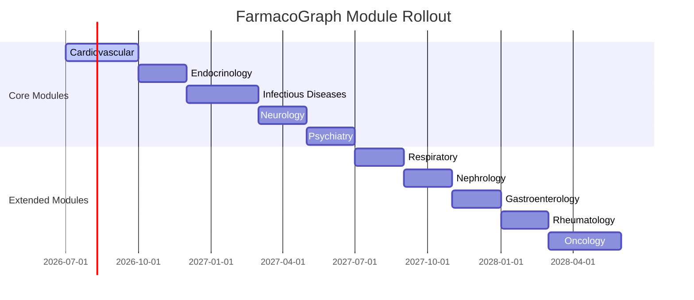

# FarmacoGraph Roadmap

> **Version:** 1.1.0  
> Phased implementation and dataset rollout — updated to reflect current repository state.

---

## Current status (July 2026)

| Phase | Status | Summary |
|-------|--------|---------|
| Phase 0 — Architecture & ontology specs | **Complete** | Design documents, ontology JSON, validation matrix |
| Phase 1 — Foundation | **Mostly complete** | Models, validators, CLI; MkDocs site not started |
| Phase 2 — Pipeline & API skeleton | **Partial** | FastAPI + core services; full pipeline orchestrator pending |
| Phase 3 — Platform infrastructure | **Complete** | PostgreSQL ops, Neo4j driver, events, jobs, metrics, CI |
| Phase 4 — Backend foundation | **Complete** | Curator API, graph writer, snapshots, validation |
| Phase 4 — Studio 4.1 | **Complete** | App shell, dashboard, search, settings |
| Phase 4 — Studio 4.2+ | **Planned** | Editors, publish wizard |
| Phase 4 — Cardiovascular data | **In progress** | Curation via Studio/API; no full module yet |
| Phase API 5.1 — Discovery + search | **Complete** | `/info`, Neo4j search provider, public search page |
| Phase API 5.2 — Auth | **Complete** | `POST /auth/token`, API key validation, curator auth gates |
| Phase API 5.3+ | **Planned** | Rate limits, OpenAPI sync |

---

## 1. Implementation phases

### Phase 0 — Architecture ✅

- [x] Final architecture document
- [x] Ontology specification
- [x] Data model specification
- [x] Education layer specification
- [x] Pipeline specification
- [x] API specification
- [x] Licensing strategy
- [x] Platform architecture review

### Phase 1 — Foundation

| Step | Deliverable | Status |
|------|-------------|--------|
| 1.1 | Repository scaffold (`pyproject.toml`, CI, linting) | ✅ |
| 1.2 | Ontology files in `ontology/` | ✅ |
| 1.3 | Pydantic models — entity groups | ✅ |
| 1.4 | JSON Schema generation | Partial |
| 1.5 | Neo4j constraints and indexes | ✅ |
| 1.6 | PostgreSQL operational schema | ✅ |
| 1.7 | Collector interfaces (abstract) | Spec only |
| 1.8 | Validator framework + validators | ✅ |
| 1.9 | Mechanism DAG engine | ✅ |
| 1.10 | Unit + validation tests | ✅ |
| 1.11 | MkDocs documentation site | Not started |

### Phase 2 — Pipeline & API

| Step | Deliverable | Status |
|------|-------------|--------|
| 2.1 | Pipeline orchestrator | Not started |
| 2.2 | Graph builder (Neo4j) | Via `GraphWriter` on publish |
| 2.3 | Version tagger (PostgreSQL) | Via snapshots |
| 2.4 | FastAPI with core endpoints | ✅ 25 routes live |
| 2.5 | Explain service | ✅ skeleton |
| 2.6 | Visualization projection | Planned |
| 2.7 | CLI (`farmacograph` command) | ✅ |
| 2.8 | Integration tests | ✅ (in-memory SQLite) |

### Phase 3 — Platform infrastructure ✅

| Step | Deliverable | Status |
|------|-------------|--------|
| 3.1 | PostgreSQL schema | ✅ |
| 3.2 | Neo4j init + driver | ✅ |
| 3.3 | Service layer + repositories | ✅ |
| 3.4 | FastAPI routers | ✅ |
| 3.5 | Event bus + outbox | ✅ |
| 3.6 | Job queue + worker abstraction | ✅ (no daemon) |
| 3.7 | Search provider interface | ✅ GraphSearchProvider |
| 3.8 | Snapshot builder | ✅ |
| 3.9 | Health + metrics | ✅ |
| 3.10 | CI/CD | ✅ |

See [phase3-infrastructure.md](phase3-infrastructure.md).

### Phase 4 — Curation platform

| Step | Deliverable | Status |
|------|-------------|--------|
| 4.1 | Curator workflow API | ✅ |
| 4.2 | Curation Studio shell | ✅ |
| 4.3 | Drug/evidence editors (Studio) | Planned |
| 4.4 | Mechanism editor + graph explorer | Planned |
| 4.5 | Publish wizard + snapshots UI | Planned |
| 4.6 | Cardiovascular module curation | In progress |
| 4.7 | First published dataset `2026.1.0` | Pending module completion |

See [phase4-curator.md](phase4-curator.md) and [studio-roadmap.md](studio-roadmap.md).

### Phase 5 — API hardening

| Step | Deliverable | Status |
|------|-------------|--------|
| 5.1 | `/info`, Neo4j search, search page | ✅ |
| 5.2 | API key validation, `POST /auth/token` | ✅ |
| 5.3 | Rate limiting middleware | Planned |
| 5.4 | OpenAPI ↔ FastAPI sync | Planned |
| 5.5 | Python + TypeScript SDKs | Planned |
| 5.6 | Deep graph API (mechanism, compare) | Pending CV data |

See [api-roadmap.md](api-roadmap.md).

### Phase 6 — Visualization & AI (future)

| Step | Deliverable |
|------|-------------|
| 6.1 | React Flow graph viewer (web) |
| 6.2 | RAG retriever + citation builder |
| 6.3 | LLM integration (read-only) |
| 6.4 | Anki export |

### Phase 7 — Ecosystem (future)

| Step | Deliverable |
|------|-------------|
| 7.1 | `fgcore` shared ontology package |
| 7.2 | Cross-module relationship specification |
| 7.3 | AnatoGraph / PathoGraph integration stubs |

---

## 2. Dataset module rollout

Drugs are added by organ-system module. Each module must be **complete** before the next begins.

### Module completion criteria

A module is "complete" when:

- [ ] All target drugs have `status: published`
- [ ] Every drug has: identity, class, ≥1 indication, mechanism DAG root
- [ ] ≥90% of drugs have key side effects and interactions
- [ ] ≥80% of drugs have education summaries
- [ ] All published edges have evidence links
- [ ] Module validation report passes with zero errors
- [ ] Dataset version tagged and exported

### Rollout order

| Order | Module | Est. drugs | Priority |
|-------|--------|-----------|----------|
| 1 | **Cardiovascular** | 60–80 | Highest exam yield |
| 2 | Endocrinology | 40–50 | Pathway-heavy |
| 3 | Infectious Diseases | 80–100 | Coverage maps |
| 4 | Neurology | 50–60 | Receptor-heavy |
| 5 | Psychiatry | 40–50 | CYP interactions |
| 6–10 | Respiratory … Oncology | 30–50 each | Extended coverage |

**Total target:** 600–800 drugs.

---

## 3. Versioning calendar

| Version | Module | Target |
|---------|--------|--------|
| `2026.1.0` | Cardiovascular | Q3 2026 |
| `2026.2.0` | + Endocrinology | Q4 2026 |
| `2026.3.0` | + Infectious Diseases | Q1 2027 |
| `2027.1.0` | + Neurology, Psychiatry | Q2 2027 |
| `2027.2.0` | Remaining modules | Q4 2027 |

---

## 4. Testing milestones

| Phase | Coverage target | Status |
|-------|-----------------|--------|
| Phase 1 | ≥90% models + validators | Met |
| Phase 2–3 | Integration tests | Met (60% CI floor) |
| Phase 4 | Curator workflow tests | Met |
| Phase 5 | Contract tests (Schemathesis) | Planned |
| Phase 6 | RAG pipeline tests | Future |

---

## 5. Decision log

| Date | ID | Decision | Rationale |
|------|-----|----------|-----------|
| 2026-07 | ADR-001 | Neo4j canonical from Day One | Graph traversal is core value |
| 2026-07 | ADR-002 | Normalized entities, no Drug blob | Single source of truth |
| 2026-07 | ADR-003 | Mechanism DAGs | Branching/merging pharmacology |
| 2026-07 | ADR-004 | Evidence as first-class entity | Explainability and AI safety |
| 2026-07 | ADR-005 | Education layer separation | Prevent mnemonic/fact confusion |
| 2026-07 | ADR-006 | Open terminology first | SNOMED/MedDRA as plugins |
| 2026-07 | ADR-007 | Module-based rollout | Quality over quantity |
| 2026-07 | ADR-008 | Apache 2.0 + CC BY 4.0 | Open platform, attribution |
| 2026-07 | ADR-010 | API is the only public interface | Platform, not database |
| 2026-07 | ADR-020 | Curation Studio as primary UI | JSON/scripts are bootstrap only |

Full ADR index: [adr/README.md](adr/README.md).

---

## 6. Next actions

1. **Cardiovascular curation** — publish drugs via curator workflow as Studio 4.2 editors ship.
2. **API 5.2** — wire API key validation and `POST /auth/token`.
3. **Studio 4.2** — Drug Editor and Evidence Manager.
4. **OpenAPI sync** — add curator, dashboard, info routes to `openapi/openapi.yaml`.

---

## Related documents

| Document | Focus |
|----------|-------|
| [product/roadmap.md](product/roadmap.md) | Long-term product versions |
| [api-roadmap.md](api-roadmap.md) | API phase plan |
| [studio-roadmap.md](studio-roadmap.md) | Curation Studio milestones |
| [architecture-diagrams.md](architecture-diagrams.md) | Runtime diagrams |
