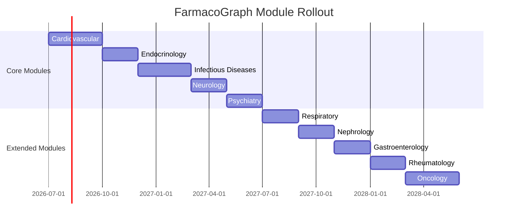

# FarmacoGraph Roadmap

> **Version:** 1.0.0-draft  
> Phased implementation and dataset rollout

---

## 1. Implementation Phases

### Phase 0 — Architecture (Current)

- [x] Final architecture document
- [x] Ontology specification
- [x] Data model specification
- [x] Education layer specification
- [x] Pipeline specification
- [x] API specification
- [x] Licensing strategy
- [ ] Architecture review approval

### Phase 1 — Foundation (No drug data)

| Step | Deliverable |
|------|-------------|
| 1.1 | Repository scaffold (`pyproject.toml`, CI, linting) |
| 1.2 | OWL/Turtle ontology files in `ontology/` |
| 1.3 | Pydantic models — one per entity group |
| 1.4 | JSON Schema generation |
| 1.5 | Neo4j constraints and indexes |
| 1.6 | PostgreSQL operational schema |
| 1.7 | Collector interfaces (abstract only) |
| 1.8 | Validator framework + all validators |
| 1.9 | Mechanism DAG engine (cycle detection, fragment registry) |
| 1.10 | Unit + schema + validation tests |
| 1.11 | MkDocs documentation site |

### Phase 2 — Pipeline & API Skeleton

| Step | Deliverable |
|------|-------------|
| 2.1 | Pipeline orchestrator |
| 2.2 | Graph builder (Neo4j) |
| 2.3 | Version tagger (PostgreSQL) |
| 2.4 | FastAPI skeleton with all endpoints |
| 2.5 | Explain service (graph traversal) |
| 2.6 | Visualization projection service |
| 2.7 | CLI (`farmacograph` command) |
| 2.8 | Integration tests with testcontainers |

### Phase 3 — Platform Infrastructure

| Step | Deliverable |
|------|-------------|
| 3.1 | PostgreSQL schema (tenants, jobs, outbox, audit, snapshots) |
| 3.2 | Neo4j constraints + indexes |
| 3.3 | Service layer (API handlers never touch DB directly) |
| 3.4 | FastAPI implementing OpenAPI contract |
| 3.5 | Event bus + transactional outbox |
| 3.6 | Job queue skeleton |
| 3.7 | Search indexer worker (FTS plugin) |
| 3.8 | Snapshot builder |
| 3.9 | Health + metrics + observability |
| 3.10 | Contract tests against OpenAPI |

See [platform-architecture.md](platform-architecture.md) for full platform design.

### Phase 4 — First Module: Cardiovascular

| Step | Deliverable |
|------|-------------|
| 3.1 | Curator tooling workflow |
| 3.2 | Manual curation of cardiovascular module (~60–80 drugs) |
| 3.3 | Mechanism DAGs for all CV drugs |
| 3.4 | Education layer for CV module |
| 3.5 | First published dataset `2026.1.0` |
| 3.6 | Validation report + attribution manifest |

### Phase 4 — Visualization & AI

| Step | Deliverable |
|------|-------------|
| 4.1 | React Flow graph viewer (web) |
| 4.2 | RAG retriever + citation builder |
| 4.3 | LLM integration (read-only) |
| 4.4 | Anki export |

### Phase 5 — Ecosystem

| Step | Deliverable |
|------|-------------|
| 5.1 | `fgcore` shared ontology package |
| 5.2 | Cross-module relationship specification |
| 5.3 | AnatoGraph / PathoGraph integration stubs |

---

## 2. Dataset Module Rollout

Drugs are **not** added randomly. Each organ-system module must be **complete** before the next begins.

### Module completion criteria

A module is "complete" when:

- [ ] All target drugs have `status: published`
- [ ] Every drug has: identity, class, ≥1 indication, mechanism DAG root
- [ ] ≥90% of drugs have key side effects and interactions
- [ ] ≥80% of drugs have education summaries (5-sec + board pearl)
- [ ] All published edges have evidence links
- [ ] Module validation report passes with zero errors
- [ ] Dataset version tagged and exported

### Rollout order

| Order | Module | Est. drugs | Priority rationale |
|-------|--------|-----------|-------------------|
| 1 | **Cardiovascular** | 60–80 | Highest exam yield; rich mechanism DAGs |
| 2 | **Endocrinology** | 40–50 | Diabetes, thyroid — pathway-heavy |
| 3 | **Infectious Diseases** | 80–100 | Coverage maps, organisms |
| 4 | **Neurology** | 50–60 | Receptor-heavy |
| 5 | **Psychiatry** | 40–50 | CYP interactions, receptor maps |
| 6 | **Respiratory** | 30–40 | Bronchodilators, steroids |
| 7 | **Nephrology** | 30–40 | Renal dosing focus |
| 8 | **Gastroenterology** | 40–50 | PPIs, IBD biologics |
| 9 | **Rheumatology** | 30–40 | DMARDs, biologics |
| 10 | **Oncology** | 40–50 | Targeted therapies |

**Total target:** 600–800 drugs across all modules.

---

## 3. Cardiovascular Module — First Target

### Scope (illustrative drug categories)

| Category | Examples |
|----------|---------|
| ACE inhibitors | Ramipril, Enalapril, Lisinopril |
| ARBs | Losartan, Valsartan |
| Beta-blockers | Metoprolol, Propranolol, Atenolol |
| Calcium channel blockers | Amlodipine, Diltiazem, Verapamil |
| Diuretics | Furosemide, Hydrochlorothiazide, Spironolactone |
| Antiarrhythmics | Amiodarone, Adenosine |
| Anticoagulants | Warfarin, Heparin, DOACs |
| Antiplatelets | Aspirin, Clopidogrel |
| Statins | Atorvastatin, Simvastatin |
| Nitrates | GTN, Isosorbide mononitrate |
| Digoxin | Digoxin |
| Inotropes | Dobutamine, Dopamine |

### Module-specific graph features to validate

- Mechanism DAGs (RAAS, beta-blockade, statin HMG-CoA)
- CYP interaction maps (warfarin, statins)
- Pregnancy safety maps (ACEi contraindication)
- Lab monitoring (digoxin levels, INR)

---

## 4. Versioning Calendar

| Version | Module | Target |
|---------|--------|--------|
| `2026.1.0` | Cardiovascular | Q3 2026 |
| `2026.2.0` | + Endocrinology | Q4 2026 |
| `2026.3.0` | + Infectious Diseases | Q1 2027 |
| `2027.1.0` | + Neurology, Psychiatry | Q2 2027 |
| `2027.2.0` | Remaining modules | Q4 2027 |

---

## 5. Testing Milestones

| Phase | Coverage target |
|-------|----------------|
| Phase 1 | ≥90% on models + validators |
| Phase 2 | Integration tests for pipeline + API |
| Phase 3 | Module regression tests (golden graph snapshots) |
| Phase 4 | RAG pipeline tests with mock LLM |

---

## 6. Decision Log

| Date | Decision | Rationale |
|------|----------|-----------|
| 2026-07 | Neo4j canonical from Day One | Graph traversal is core value |
| 2026-07 | Normalized entities, no Drug blob | Single source of truth |
| 2026-07 | Mechanism DAGs | Branching/merging pharmacology |
| 2026-07 | Evidence as first-class entity | Explainability and AI safety |
| 2026-07 | Education layer separation | Prevent mnemonic/fact confusion |
| 2026-07 | Open terminology first | SNOMED/MedDRA as plugins |
| 2026-07 | Module-based rollout | Quality over quantity |
| 2026-07 | Apache 2.0 + CC BY 4.0 | Open platform, attribution datasets |

---

## 7. Next Action

**Await architecture approval**, then begin Phase 1.1: repository scaffold.

No pharmacology data will be generated until curator workflow and validators are in place.
