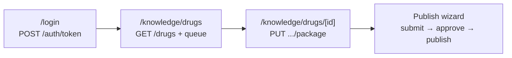
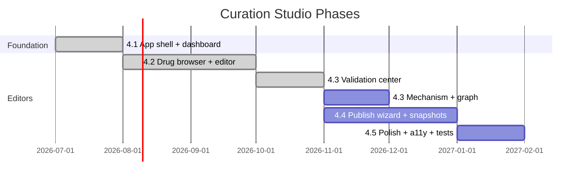
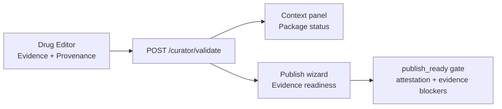
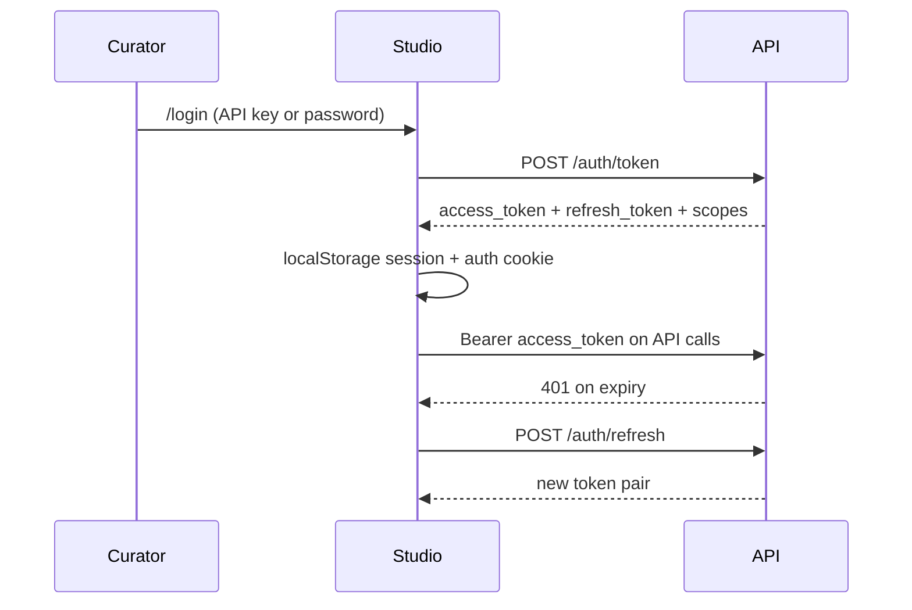
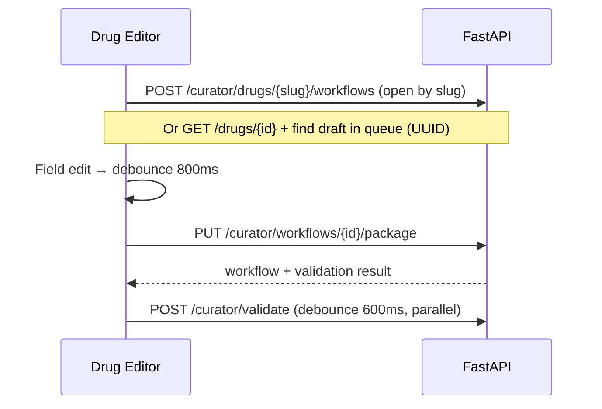

# Curation Studio Roadmap

> **Product:** [Curation Studio](curation-studio.md) (`apps/studio`)  
> **Status:** Phase 4.2 secure curation path complete — dashboard, auth, drug browser, drug editor, validation center  
> **Backend dependency:** [Phase 4 curator API](phase4-curator.md), [API auth](api.md#auth-current)

The Curation Studio is the official interface for authoring, reviewing, validating, and publishing biomedical knowledge. All Studio features consume the public FarmacoGraph REST API — never Neo4j or PostgreSQL directly.

---

## Current state

| Route | Status | Notes |
|-------|--------|-------|
| `/` (Dashboard) | **Complete** | `GET /api/v1/dashboard` — stats, curator queue, validation, jobs, activity; 15s auto-refresh |
| `/login` | **Complete** | API key or password via `POST /api/v1/auth/token`; middleware + `AuthGate` guards |
| `/search` | **Complete** | Drug search via `GET /search` |
| `/settings` | **Complete** | Manual JWT/API key, session scopes, API URL config |
| `/knowledge/drugs` | **Complete** | Drug Browser — merges `GET /drugs`, `GET /search`, `GET /modules`, `GET /curator/queue`; opens editor at `/knowledge/drugs/{slug\|id}` |
| `/knowledge/drugs/[id]` | **Complete** | Drug Editor — sectioned fields, debounced autosave (`PUT .../package`), live validation |
| `/validation` | **Complete** | Validation Center — `GET /curator/validation-summary`, queue dry-runs via `POST /curator/validate` |
| `/knowledge/diseases` | **Connected** | Disease browser for shared disease nodes and curator workflows |
| `/knowledge/education`, `/knowledge/mechanisms` | **Connected surface** | Read-only navigation surface; editor/API contracts deferred |
| `/knowledge/evidence` | **Complete** | Evidence manager — browse/search/create via `GET/POST /evidence` |
| `/graph` | **Connected surface** | Preview/navigation surface; graph query explorer deferred |
| `/snapshots` | **Connected** | Dashboard snapshot marker + recently published workflows |
| `/activity` | **Connected** | Audit log + background jobs surface |
| `/users` | **Placeholder** | Admin view deferred |

**Shell features (complete):** sidebar navigation, dark mode, command palette (⌘K), workspace switcher, error boundaries, loading skeletons, typed API client with retries, React Query data layer, Docker production build, two-layer route protection (middleware + client guards).

---

## Sprint focus: secure curation path

The secure curation path from login through **publish** is **live** in Studio (Drug Editor publish wizard).



| Task | Deliverable | API dependencies | Status |
|------|-------------|------------------|--------|
| API 5.2 | JWT issuance + API key validation | `POST /auth/token`, `POST /auth/refresh`, `POST /auth/introspect` | **Complete** |
| Studio auth | Login page, session refresh, scope guards | Auth endpoints | **Complete** |
| Studio 4.2.2 | Drug Browser — pagination, module filter, status badges | `GET /drugs`, `GET /modules`, `GET /curator/queue` | **Complete** |
| Studio 4.2.3 | Drug Editor — section autosave, context panel | `POST /curator/drugs/{slug}/workflows`, `PUT /curator/workflows/{id}/package`, `POST /curator/validate` | **Complete** |
| Studio 4.3 | Validation Center — grouped issues, publish readiness | `POST /curator/validate`, `GET /curator/validation-summary` | **Complete** |
| Studio 4.4 | Publish wizard — submit, approve, publish from UI | `POST /curator/workflows/{id}/submit`, `/approve`, `/publish` | **Complete** |

### Workflow state machine (backend — live)

Enforced in `farmacograph/curator/workflow.py` (FG-C023):

| From | Allowed transitions |
|------|---------------------|
| `draft` | → `review` |
| `review` | → `draft`, `approved` |
| `approved` | → `published`, `draft` |
| `published` | → `deprecated` |

Package edits (`PUT .../package`) are permitted only in `draft` and `review`. Publish requires `approved` state and `curator:publish` scope.

---

## Phase map



### Studio 4.1 — Application foundation ✅

| Deliverable | Status |
|-------------|--------|
| Next.js 15 App Router project | Done |
| App shell (sidebar, top nav, command palette) | Done |
| Theme provider (light/dark/system) | Done |
| Auth context + `/login` + `/settings` | Done |
| `FarmacoGraphClient` with retries and error normalization | Done |
| Dashboard with curator queue and system health | Done |
| Global search page | Done |
| Connected surfaces for future modules | Done — deferred editors route back into live Drug/Evidence/Validation workflow |
| Docker standalone build | Done |

### Studio 4.2 — Knowledge editors (drug path complete)

| Deliverable | API dependency | Status |
|-------------|----------------|--------|
| **4.2.2 Drug Browser** | `GET /drugs`, `GET /search`, `GET /modules`, `GET /curator/queue` | **Complete** |
| **4.2.3 Drug Editor** (Obsidian-style) | `POST /curator/drugs/{slug}/workflows`, `PUT /curator/workflows/{id}/package`, `POST /curator/validate` | **Complete** |
| Disease / indication browser | `GET /diseases`, `GET /curator/diseases` | **Connected** — browser surface; full authoring deferred |
| Evidence Manager | `/evidence` + drug attach endpoints | **Live** — global browser + Drug Editor section; live-stack Neo4j coverage still needed |
| Educational layer surface | Education endpoints (planned) | **Connected surface** — no fake editor until API contracts land |
| Relationship Editor | Graph write via curator publish | Planned |

#### Drug Editor layout (4.2.3 — Obsidian, not Notion)

The editor is not a long form page. It is a **knowledge workspace**:

| Pane | Purpose |
|------|---------|
| **Center** | Sectioned field editor — autosave per section, immediate validation, provenance/confidence on fields |
| **Right (live)** | Context panel fed by API: related mechanisms, linked diseases, evidence count, recent changes, publish preview, validation results, graph neighborhood |

The right panel updates as the curator edits so they always see where the drug sits in the graph — essential for consistency at hundreds of entities.

**Exit criteria (met for draft editing):** Create and edit a draft drug package in Studio with autosave and live validation.

**Evidence workflow (partial):** Curators attach or create evidence in the Drug Editor **Evidence** section, set `curator_attestation` in **Provenance**, dry-run validation in the context panel, and review **Evidence readiness** in the Publish wizard. See [§ Evidence workflow](#evidence-workflow-partial).

**Publish workflow (Studio 4.4):** Submit-to-review, approve, and publish are exposed in the Drug Editor **Publish wizard** with role/scope gating for `curator:publish`.

**Building blocks in codebase:** `PropertyEditor`, `ValidationBadge`, `ConfidenceBadge`, drug editor autosave (`apps/studio/src/components/drug-editor/`), `PublishWizard` + `WorkflowStatePanel`, React Query hooks for draft save and publish transitions.

### Studio 4.3 — Graph and validation

| Deliverable | Technology | Status |
|-------------|------------|--------|
| **Validation Center** | Grouped errors from `/curator/validate`, `/curator/validation-summary` | **Complete** |
| Mechanism surface | React Flow DAG later | **Connected surface** — editor deferred |
| Graph Explorer | Cytoscape.js later | **Connected surface** — query/canvas deferred |

The Validation Center (`/validation`) surfaces summary stats, publish readiness, grouped issue sections (errors, warnings, ontology violations, missing evidence), and client-side dry-runs for up to 15 queue items. Auto-refreshes every 30 seconds.

**Exit criteria (partial):** Resolve validation errors before submit — met via editor + validation center. Mechanism DAG visualization remains planned.

### Evidence workflow (partial)

Evidence readiness is split across **provenance fields**, **validation grouping**, and the **publish wizard** — not a standalone manager UI.



| Component | Path / API | Status |
|-----------|------------|--------|
| Evidence editor panel | Drug Editor → **Evidence** | **Live** — attach/create via `evidence-client.ts` |
| Provenance editor | Drug Editor → **Provenance** | **Live** |
| Dry-run validation | `POST /curator/validate` | **Live** |
| Missing evidence panel | `/validation` | **Live** |
| Publish wizard evidence readiness | Drug Editor → Publish | **Live** — blockers, missing, low-confidence |
| Global Evidence Manager | `/knowledge/evidence` | **Live** — `EvidenceBrowser` (search, filters, create) |
| Evidence list/create API | `GET/POST /api/v1/evidence` | **Live** (Neo4j required for writes) |
| Drug evidence list | `GET /curator/drugs/{slug}/evidence` or `GET /drugs/{uuid}/evidence` | **Live** — slug editor context first; UUID route when slug is absent |
| Drug attach/detach | `POST/DELETE /curator/drugs/{slug}/evidence` or `POST/DELETE /drugs/{uuid}/evidence` | **Live** — no unscoped `/evidence?drug_id=` fallback |
| Assertion `SUPPORTED_BY` UI | Mechanism / relationship editors | **Planned** (4.3+) |

**Client-side attestation gate:** `computePublishReady` requires `entity_payload.provenance.curator_attestation === true` in addition to `valid: true` from the validator.

**Tests:** Unit — `drug-editor/__tests__/package.test.ts`, `drug-editor/__tests__/evidence-helpers.test.ts`, `publish-wizard/validation/__tests__/evidence-gating.test.ts`. E2E — `apps/studio/e2e/evidence-workflow.spec.ts` (Playwright mocks).

**Gaps (honest):** Drug evidence routes are routed in FastAPI and covered by stricter mocks; live-stack coverage is still needed for production-like Neo4j attach/create paths. Assertion-level attach is not in UI; Neo4j is required for evidence writes in production API.

### Studio 4.4 — Publish and release

| Deliverable | API dependency | Status |
|-------------|----------------|--------|
| Diff Viewer (draft vs published) | Snapshot comparison (planned) | Not started |
| Snapshot Manager | `KnowledgeSnapshot` HTTP API (planned) | `/snapshots` connected to dashboard snapshot marker; diff/release manager deferred |
| **Publish Wizard** | `POST /curator/workflows/{id}/submit`, `/approve`, `/publish` | **Complete** — Drug Editor dialog |
| AI Draft Assistant | External LLM plugin (draft only, never auto-publish) | Planned |

**Exit criteria (met):** End-to-end publish from Studio via Publish wizard; snapshot result shown after publish.

**Dev-only:** Curator transition endpoints remain available via curl/API for automation; production curators use Studio.

### Studio 4.5 — Production readiness

| Deliverable | Notes |
|-------------|-------|
| Role-based UI gating (`hasRole`) | Wired to JWT scopes |
| Activity timeline | `GET /audit-logs`, `GET /jobs` — dedicated `/activity` surface live |
| Background jobs panel | `GET /jobs` (partial on dashboard) |
| E2E tests (Playwright) | `apps/studio/e2e/` — drug navigation, publish wizard, **evidence workflow** smoke |
| Unit tests (Vitest) | API client, auth, utils |
| Accessibility audit | WCAG 2.1 AA target |
| Performance (code splitting, virtualized lists) | Large drug lists |

---

## Authentication in Studio

Studio auth is **client-complete** and connects to backend auth endpoints when the API is running with PostgreSQL.



| Layer | Implementation |
|-------|----------------|
| Sign-in | `/login` — `loginWithApiKey`, `loginWithPassword` |
| Manual credentials | `/settings` — paste JWT, refresh token, or API key |
| Session storage | `localStorage` + cookie `farmacograph.studio.authenticated` |
| Server guard | `middleware.ts` — redirect unauthenticated users from protected paths |
| Client guard | `AuthGate` — scope/role checks per route |
| API headers | `Authorization: Bearer <token\|apiKey>`, optional `X-API-Key` |

**Protected routes:** `/knowledge/*` and `/validation` require `curator:write`; `/snapshots` requires `curator:publish`; `/users` requires `administrator` role.

**Fallback:** If auth endpoints return 404/501 (older API builds), API key login stores a client-only session with default curator scopes; password login prompts for Settings/manual JWT.

**API keys:** Format `fg_{prefix}_{secret}`. Exchange via `grant_type: api_key` on `/auth/token`, or send directly as `Authorization: Bearer fg_…` or `X-API-Key` header. Keys are stored as prefix + SHA-256 hash in PostgreSQL — no self-service key management UI yet.

Key files: `apps/studio/src/lib/auth/`, `apps/studio/src/middleware.ts`

---

## Canonical autosave workflow

Studio drug editing persists drafts through the **curator workflow API** — not direct entity PATCH. Draft packages live in PostgreSQL (`draft_package_json`) until publish writes to Neo4j.



| Step | API | Purpose |
|------|-----|---------|
| Open workflow | `POST /curator/drugs/{slug}/workflows` | Load or create draft for slug |
| Bootstrap draft | `POST /curator/workflows` | Create draft when opening by UUID |
| **Autosave** | `PUT /curator/workflows/{id}/package` | Persist `entity_payload`, `relationships`, `related_entities` |
| Live validation | `POST /curator/validate` | Dry-run without state transition |
| Publish (Studio wizard) | `POST .../submit` → `.../approve` → `.../publish` | State machine to Neo4j |

**Transition scopes:** `submit` requires `curator:write`; `approve` and `publish` require `curator:publish`.

Implementation: `apps/studio/src/components/drug-editor/autosave.ts`, `use-drug-editor.ts`. Backend: `farmacograph/api/routers/curator.py`, `farmacograph/services/curator.py`.

### Dev-only / deprecated: manual JSON and shell publishing

The following are **not** curator workflows — development, CI, and emergency recovery only:

| Path | Purpose |
|------|---------|
| `scripts/dev-only/publish-drug.sh` | Publish a local JSON package via API (legacy bootstrap) |
| `scripts/dev-only/publish-stub.sh` | One-time structural stub via API |
| `scripts/dev-only/bootstrap-cv.sh` | Stub + curriculum queue summary |
| `staging/` | Internal JSON fixtures |
| `python3 -m farmacograph init-drug-entry` | Scaffold new drug JSON entry |

Curators must use Curation Studio or the curator REST API. See [scripts/dev-only/README.md](../scripts/dev-only/README.md).

---

## Architecture decisions

| ID | Decision | Rationale |
|----|----------|-----------|
| ADR-020 | Studio is the only curator UI | JSON/scripts are bootstrap only |
| ADR-021 | Studio never touches databases | API-first consistency |
| ADR-022 | AI drafts, humans publish | Clinical accountability |
| ADR-023 | Separate education editor | Layer separation in UI |
| ADR-024 | Next.js App Router + React Query | Typed client, server-state caching |
| ADR-025 | Dual auth: JWT + API key | Studio login + integration clients |

---

## Technology stack

| Layer | Choice |
|-------|--------|
| Framework | Next.js 15, React 19, TypeScript |
| Styling | Tailwind CSS, shadcn/ui (Radix primitives) |
| Data fetching | TanStack React Query |
| Forms | React Hook Form + Zod |
| Graphs (4.3+) | React Flow, Cytoscape.js |
| Auth | `POST /auth/token` + JWT refresh; Settings fallback |

---

## API client coverage

Implemented in `apps/studio/src/lib/api/client.ts`:

| Method | Endpoint | Used in UI |
|--------|----------|------------|
| `health()` | `GET /health` | Dashboard |
| `info()` | `GET /info` | Dashboard |
| `statistics()` | `GET /statistics` | Dashboard |
| `modules()` | `GET /modules` | Drug Browser |
| `curriculum(slug)` | `GET /modules/{slug}/curriculum` | Dashboard, Drug Browser |
| `curatorQueue(state)` | `GET /curator/queue` | Dashboard, Drug Browser, Drug Editor |
| `drugs(…)` | `GET /drugs` | Drug Browser, Dashboard fallback |
| `search(q)` | `GET /search` | Search page, Drug Browser |
| `getDrug(id)` | `GET /drugs/{id}` | Drug Editor (UUID load) |
| `openDrugWorkflow(slug)` | `POST /curator/drugs/{slug}/workflows` | Drug Editor |
| `createWorkflow(…)` | `POST /curator/workflows` | Drug Editor |
| `getWorkflow(id)` | `GET /curator/workflows/{id}` | Drug Editor |
| `saveWorkflowPackage(…)` | `PUT /curator/workflows/{id}/package` | Drug Editor autosave |
| `validatePackage(…)` | `POST /curator/validate` | Drug Editor, Validation Center |
| `validationSummary()` | `GET /curator/validation-summary` | Validation Center |
| `auditLogs()` | `GET /audit-logs` | Drug Editor context panel |
| `explain(…)` | `GET /explain` | Drug Editor context panel |
| `submitWorkflow` / `approveWorkflow` / `publishWorkflow` | Curator transitions | **Wired** — Publish wizard mutations + cache invalidation |

**Not yet wired to feature UI:** graph explorer, mechanism editor, dedicated activity/users pages, snapshot manager page. Dashboard composes some ops data via `GET /dashboard`.

---

## Running locally

```bash
# Terminal 1 — API (PostgreSQL required for auth)
./scripts/dev.sh api

# Terminal 2 — Studio
cd apps/studio
cp .env.example .env.local
npm install
npm run dev
```

Open http://localhost:3000. Sign in at `/login` with the dev curator (`curator@farmacograph.local` / `curator-dev-password` when seeded) or configure credentials in Settings. Set API URL via `NEXT_PUBLIC_API_URL` (default `http://127.0.0.1:8001/api/v1`).

Docker full stack: `docker compose up -d` — Studio at http://localhost:3001 (base path `/studio` in production).

---

## Related documents

| Document | Focus |
|----------|-------|
| [curation-studio.md](curation-studio.md) | Product specification |
| [phase4-curator.md](phase4-curator.md) | Backend curator API |
| [deploy-studio.md](deploy-studio.md) | Production deployment |
| [api.md](api.md) | REST API reference |
| [adr/README.md](adr/README.md) | Architecture decisions |
