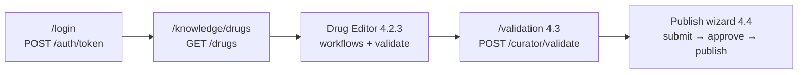
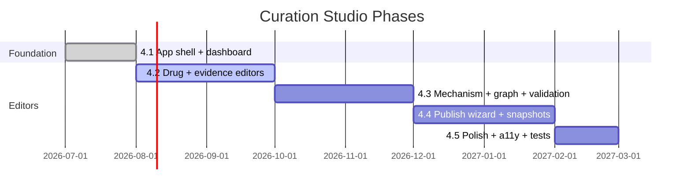
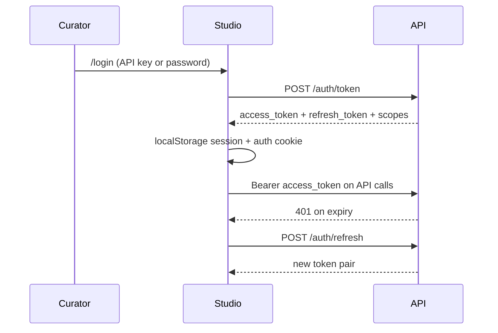

# Curation Studio Roadmap

> **Product:** [Curation Studio](curation-studio.md) (`apps/studio`)  
> **Status:** Phase 4.2.1 complete — dashboard + auth; **4.2.2 Drug List** next  
> **Backend dependency:** [Phase 4 curator API](phase4-curator.md), [API auth](api.md#auth-current)

The Curation Studio is the official interface for authoring, reviewing, validating, and publishing biomedical knowledge. All Studio features consume the public FarmacoGraph REST API — never Neo4j or PostgreSQL directly.

---

## Current state

| Route | Status | Notes |
|-------|--------|-------|
| `/` (Dashboard) | **Complete** | `GET /api/v1/dashboard` — stats, curator queue, validation, jobs, activity; 15s auto-refresh |
| `/login` | **Complete** | API key or password via `POST /api/v1/auth/token`; middleware + `AuthGate` guards |
| `/search` | **Complete** | Drug search via `GET /search` |
| `/settings` | **Complete** | Manual JWT/API key, session scopes, API URL config |
| `/knowledge/drugs` | **Placeholder** | Studio 4.2.2 — Drug List (next sprint task) |
| `/knowledge/diseases`, `/evidence`, `/education`, `/mechanisms` | **Placeholder** | Studio 4.2 |
| `/graph`, `/validation` | **Placeholder** | Studio 4.3 — Graph Explorer, Validation Center |
| `/snapshots` | **Placeholder** | Studio 4.4 |
| `/activity`, `/users` | **Placeholder** | Soon |

**Shell features (complete):** sidebar navigation, dark mode, command palette (⌘K), workspace switcher, error boundaries, loading skeletons, typed API client with retries, React Query data layer, Docker production build, two-layer route protection (middleware + client guards).

---

## Sprint focus: secure curation path

The current engineering sprint wires the first end-to-end curator workflow in Studio:



| Task | Deliverable | API dependencies | Status |
|------|-------------|------------------|--------|
| API 5.2 | JWT issuance + API key validation | `POST /auth/token`, `POST /auth/refresh` | **Complete** |
| Studio auth | Login page, session refresh, scope guards | Auth endpoints | **Complete** |
| Studio 4.2.2 | Drug List — pagination, module filter, status badges | `GET /drugs`, `GET /curator/queue` | **Next** |
| Studio 4.2.3 | Drug Editor — section autosave, context panel | `POST /curator/workflows`, `GET /curator/workflows/{id}`, `POST /curator/validate` | Planned |
| Studio 4.3 | Validation Center — grouped issues, fix hints | `POST /curator/validate`, `GET /curator/validation-summary` | Planned |

---

## Phase map



### Studio 4.1 — Application foundation ✅

| Deliverable | Status |
|-------------|--------|
| Next.js 15 App Router project | Done |
| App shell (sidebar, top nav, command palette) | Done |
| Theme provider (light/dark/system) | Done |
| Auth context + `/login` + `/settings` | Done |
| `FarmacoGraphClient` with retries and error normalization | Done |
| Dashboard with curator queue and system health | Done |
| Global search page | Done |
| Placeholder pages for future modules | Done |
| Docker standalone build | Done |

### Studio 4.2 — Knowledge editors (in progress)

| Deliverable | API dependency | Status |
|-------------|----------------|--------|
| **4.2.2 Drug List** | `GET /drugs`, `GET /modules`, `GET /curator/queue` | Next |
| **4.2.3 Drug Editor** (Obsidian-style) | `POST /curator/workflows`, `GET /curator/workflows/{id}`, `POST /curator/validate` | Planned |
| Disease / indication authoring | Entity endpoints (planned) | Placeholder page |
| Evidence Manager | Evidence endpoints (planned) | Placeholder page |
| Educational layer editor | Education endpoints (planned) | Placeholder page |
| Relationship Editor | Graph write via curator publish | Planned |

#### Drug Editor layout (4.2.3 — Obsidian, not Notion)

The editor is not a long form page. It is a **knowledge workspace**:

| Pane | Purpose |
|------|---------|
| **Center** | Sectioned field editor — autosave per section, immediate validation, provenance/confidence on fields |
| **Right (live)** | Context panel fed by API: related mechanisms, linked diseases, evidence count, recent changes, publish preview, validation results, graph neighborhood |

The right panel updates as the curator edits so they always see where the drug sits in the graph — essential for consistency at hundreds of entities.

**Exit criteria:** Create and edit a draft drug package in Studio; submit to review queue without CLI.

**Building blocks already in codebase:** `PropertyEditor`, `ValidationBadge`, `ConfidenceBadge`, React Query hooks (`useDrug`, `usePublishedDrugs`), curator mutation methods on `FarmacoGraphClient`.

### Studio 4.3 — Graph and validation

| Deliverable | Technology | Status |
|-------------|------------|--------|
| Mechanism Editor | React Flow DAG | Placeholder page |
| Graph Explorer | Cytoscape.js | Placeholder page |
| **Validation Center** | Grouped errors from `/curator/validate`, `/curator/validation-summary` | Placeholder page |

Dashboard already surfaces validation summary (`failed_count`, `recent_failures`) from `GET /dashboard`. The dedicated Validation Center will add grouped issue views, drill-down, and fix suggestions.

**Exit criteria:** Visualize mechanism DAG; resolve validation errors before submit.

### Studio 4.4 — Publish and release

| Deliverable | API dependency |
|-------------|----------------|
| Diff Viewer (draft vs published) | Snapshot comparison (planned) |
| Snapshot Manager | `KnowledgeSnapshot` HTTP API (planned) |
| Publish Wizard | `/curator/workflows/{id}/approve`, `/publish` |
| AI Draft Assistant | External LLM plugin (draft only, never auto-publish) |

**Exit criteria:** End-to-end publish from Studio with snapshot preview.

### Studio 4.5 — Production readiness

| Deliverable | Notes |
|-------------|-------|
| Role-based UI gating (`hasRole`) | Wired to JWT scopes |
| Activity timeline | `GET /audit-logs` (partial on dashboard) |
| Background jobs panel | `GET /jobs` (partial on dashboard) |
| E2E tests (Playwright) | Scaffold in `apps/studio/e2e/` |
| Unit tests (Vitest) | API client, auth, utils |
| Accessibility audit | WCAG 2.1 AA target |
| Performance (code splitting, virtualized lists) | Large drug lists |

---

## Authentication in Studio

Studio auth is **client-complete** and connects to backend auth endpoints when the API is running with PostgreSQL.



| Layer | Implementation |
|-------|----------------|
| Sign-in | `/login` — `loginWithApiKey`, `loginWithPassword` |
| Manual credentials | `/settings` — paste JWT, refresh token, or API key |
| Session storage | `localStorage` + cookie `farmacograph.studio.authenticated` |
| Server guard | `middleware.ts` — redirect unauthenticated users from protected paths |
| Client guard | `AuthGate` — scope/role checks per route |
| API headers | `Authorization: Bearer <token\|apiKey>`, optional `X-API-Key` |

**Protected routes:** `/knowledge/*` and `/validation` require `curator:write`; `/snapshots` requires `curator:publish`; `/users` requires `administrator` role.

**Fallback:** If auth endpoints return 404/501 (older API builds), API key login stores a client-only session with default curator scopes; password login prompts for Settings/manual JWT.

Key files: `apps/studio/src/lib/auth/`, `apps/studio/src/middleware.ts`

---

## Architecture decisions

| ID | Decision | Rationale |
|----|----------|-----------|
| ADR-020 | Studio is the only curator UI | JSON/scripts are bootstrap only |
| ADR-021 | Studio never touches databases | API-first consistency |
| ADR-022 | AI drafts, humans publish | Clinical accountability |
| ADR-023 | Separate education editor | Layer separation in UI |
| ADR-024 | Next.js App Router + React Query | Typed client, server-state caching |
| ADR-025 | Dual auth: JWT + API key | Studio login + integration clients |

---

## Technology stack

| Layer | Choice |
|-------|--------|
| Framework | Next.js 15, React 19, TypeScript |
| Styling | Tailwind CSS, shadcn/ui (Radix primitives) |
| Data fetching | TanStack React Query |
| Forms | React Hook Form + Zod |
| Graphs (4.3+) | React Flow, Cytoscape.js |
| Auth | `POST /auth/token` + JWT refresh; Settings fallback |

---

## API client coverage

Implemented in `apps/studio/src/lib/api/client.ts`:

| Method | Endpoint | Used in UI |
|--------|----------|------------|
| `health()` | `GET /health` | Dashboard |
| `info()` | `GET /info` | Dashboard |
| `statistics()` | `GET /statistics` | Dashboard |
| `modules()` | `GET /modules` | Hook only |
| `curriculum(slug)` | `GET /modules/{slug}/curriculum` | Dashboard |
| `curatorQueue(state)` | `GET /curator/queue` | Dashboard |
| `drugs(module?)` | `GET /drugs` | Dashboard fallback |
| `search(q)` | `GET /search` | Search page |
| `getDrug(id)` | `GET /drugs/{id}` | Hook only |
| `createWorkflow(…)` | `POST /curator/workflows` | Hook only |
| `validatePackage(…)` | `POST /curator/validate` | Hook only |
| `submitWorkflow` / `approveWorkflow` / `publishWorkflow` | Curator transitions | Hook only |

**Not yet wired to feature UI:** drug list, drug editor, validation center, publish wizard, audit logs, jobs (dashboard composes some of these via `/dashboard`).

---

## Running locally

```bash
# Terminal 1 — API (PostgreSQL required for auth)
./scripts/dev.sh api

# Terminal 2 — Studio
cd apps/studio
cp .env.example .env.local
npm install
npm run dev
```

Open http://localhost:3000. Sign in at `/login` with the dev curator (`curator@farmacograph.local` / `curator-dev-password` when seeded) or configure credentials in Settings. Set API URL via `NEXT_PUBLIC_API_URL` (default `http://127.0.0.1:8001/api/v1`).

Docker full stack: `docker compose up -d` — Studio at http://localhost:3001 (base path `/studio` in production).

---

## Related documents

| Document | Focus |
|----------|-------|
| [curation-studio.md](curation-studio.md) | Product specification |
| [phase4-curator.md](phase4-curator.md) | Backend curator API |
| [deploy-studio.md](deploy-studio.md) | Production deployment |
| [api.md](api.md) | REST API reference |
| [adr/README.md](adr/README.md) | Architecture decisions |
