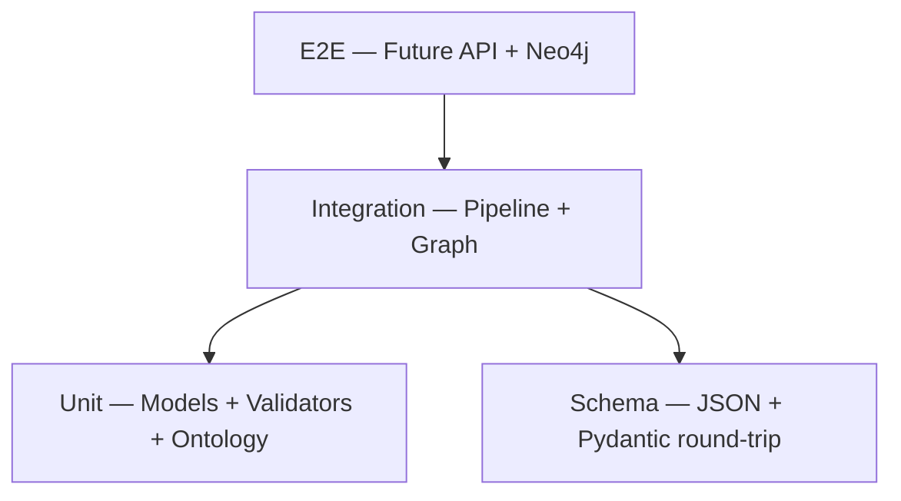

# Test Strategy

> **Version:** 1.0.0 | Phase 2 foundation testing

## Test Pyramid



## Test Categories

| Category | Directory | Focus | Coverage target |
|----------|-----------|-------|-----------------|
| **Unit** | `tests/unit/` | Pure logic | ≥90% |
| **Ontology** | `tests/ontology/` | Registry, relationship rules | 100% constraints |
| **Schema** | `tests/schema/` | Pydantic model validation | All entity types |
| **Validation** | `tests/validation/` | Four-level validators | All FG-C rules |
| **Graph** | `tests/graph/` | DAG acyclicity, projections | Future + testcontainers |
| **Integration** | `tests/integration/` | Pipeline, API | Future |
| **Regression** | `tests/regression/` | Golden graph snapshots | Per module publish |
| **Contract** | `tests/contract/` | OpenAPI response shapes | All endpoints |

## Current Tests (Phase 2)

```
tests/
├── conftest.py                          # Fixtures — structural stubs only
├── ontology/
│   └── test_registry.py                 # Registry load, FG-C001
├── validation/
│   ├── test_ontology_validator.py       # Forbidden relationships
│   └── test_education_validator.py      # FG-C013, FG-C029
```

## Fixtures Policy

**No real pharmacology data in tests.** Use structural stubs:

- `structural-stub-drug` — minimal valid Drug payload
- Synthetic UUIDs
- `source: manual`, `status: draft`

## Validation Test Matrix

Each constraint should have ≥1 test:

| Constraint | Test file | Status |
|-----------|-----------|--------|
| FG-C001 | `test_ontology_validator.py` | ✓ |
| FG-C005 | `test_ontology_validator.py` | ✓ |
| FG-C013 | `test_education_validator.py` | ✓ |
| FG-C029 | `test_education_validator.py` | ✓ |
| FG-C003 | `tests/graph/test_dag.py` | Planned |
| FG-C008–C028 | `tests/validation/test_biomedical.py` | Planned |

## Running Tests

```bash
pip install -e ".[dev]"
pytest
pytest --cov=farmacograph --cov-report=term-missing
```

## CI Pipeline (Planned)

```yaml
# .github/workflows/ci.yml
- ruff check farmacograph tests
- mypy farmacograph
- pytest --cov=farmacograph --cov-fail-under=80
- validate openapi/openapi.yaml
- load ontology/relationships.json + constraints.json
```

## Graph Tests (Future — testcontainers)

```python
# tests/graph/test_dag.py (planned)
def test_mechanism_dag_detects_cycle():
    """FG-C003: Cycle in PRECEDES chain must fail validation."""
```

## Contract Tests (Future)

Validate API responses against `openapi/openapi.yaml` using schemathesis or similar.

## Regression Tests (Per Module Publish)

Golden files in `tests/regression/snapshots/`:

- `cardiovascular-2026.1.0-graph.json` — entity/relationship counts
- Validation report hash matches `dataset_versions.validation_hash`

## Performance Tests (Future)

| Query | Target |
|-------|--------|
| `GET /drugs/{id}` | <50ms p95 |
| `GET /explain` | <200ms p95 |
| `GET /drugs/{id}/graph?depth=2` | <100ms p95 |
