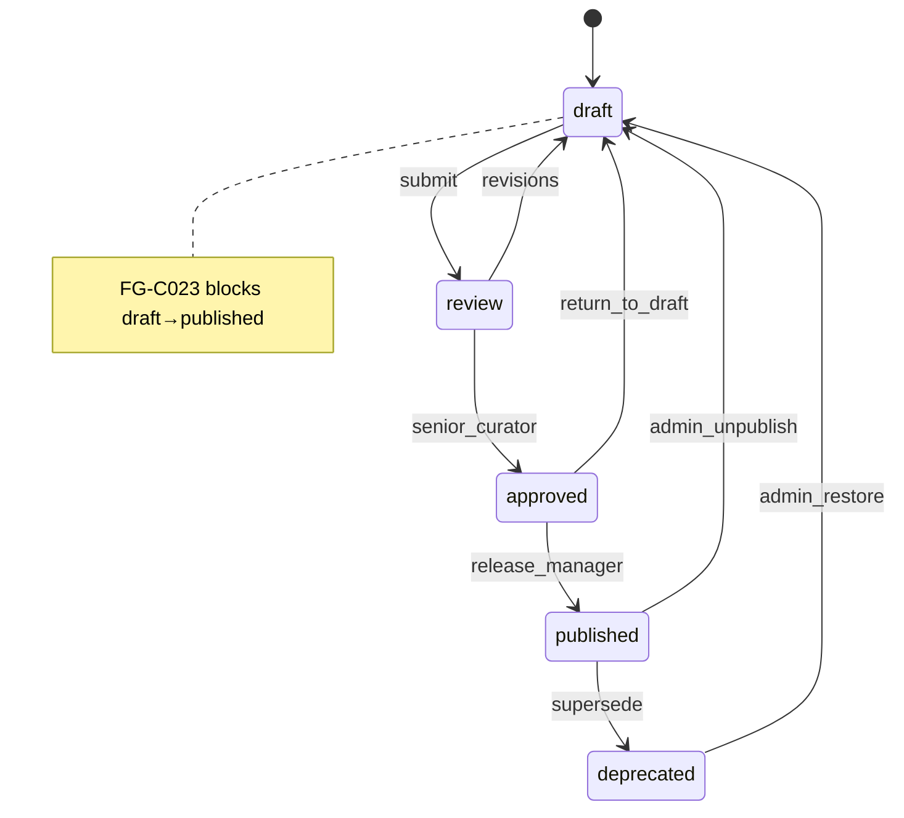

# Validation Matrix

> **Version:** 1.0.0 | Four validation levels × constraint registry

## Validation Levels

| Level | Validator | Scope | Fail on publish |
|-------|-----------|-------|-----------------|
| **Schema** | `SchemaValidator` | Pydantic model compliance, field types, enums | Yes |
| **Ontology** | `OntologyValidator` | Relationship semantics, allowed/forbidden pairs | Yes |
| **Biomedical** | `BiomedicalValidator` | Clinical completeness, provenance, mechanism roots | Yes |
| **Educational** | `EducationValidator` | Layer separation, no clinical assertions | Yes |

## Constraint × Level Matrix

| ID | Constraint | Schema | Ontology | Biomedical | Educational |
|----|-----------|:------:|:--------:|:----------:|:-----------:|
| FG-C001 | Drug must not TARGET Disease | | ✓ | | |
| FG-C002 | Drug must not IS_A Disease | | ✓ | | |
| FG-C003 | Mechanism DAG acyclic | | ✓ | ✓ | |
| FG-C004 | Interaction symmetric | | ✓ | ✓ | |
| FG-C005 | No self-interaction | | ✓ | | |
| FG-C006 | IS_A / PART_OF acyclic | | ✓ | | |
| FG-C007 | Learning graph acyclic | | ✓ | | |
| FG-C008 | Published drug has class | | | ✓ | |
| FG-C009 | Published drug has indication | | | ✓ | |
| FG-C010 | Evidence cannot treat disease | | ✓ | | |
| FG-C011 | References via Evidence only | | ✓ | ✓ | |
| FG-C012 | Published edge requires Evidence | | | ✓ | |
| FG-C013 | Education no clinical edges | | ✓ | | ✓ |
| FG-C014 | Education no biomedical assertions | | | | ✓ |
| FG-C015 | Published drug has mechanism root | | | ✓ | |
| FG-C016 | Mechanism terminal outcome | | | ✓ (warn) | |
| FG-C017 | No orphan mechanism fragments | | ✓ | ✓ | |
| FG-C018 | Provenance required | ✓ | | ✓ | |
| FG-C019 | Confidence metadata required | ✓ | | ✓ | |
| FG-C020 | Explanation required | ✓ | | ✓ | |
| FG-C021 | No duplicate external ID | | | ✓ | |
| FG-C022 | ATC class consistency | | | ✓ (warn) | |
| FG-C023 | No direct draft→publish | | | ✓ | |
| FG-C024 | Deprecated has successor | | | ✓ (warn) | |
| FG-C025 | CAUSES requires mechanism path | | | ✓ (warn) | |
| FG-C026 | FIRST_LINE requires guideline | | | ✓ (warn) | |
| FG-C027 | Broken link detection | | ✓ | ✓ | |
| FG-C028 | AI draft not publishable | | | ✓ | |
| FG-C029 | Education layer flag | ✓ | | | ✓ |
| FG-C030 | PostgreSQL no biomedical data | arch | | | |

## Workflow State Transitions

## Publish Gate Checklist

All must pass before `dataset_version` publish:

- [ ] Schema validation: 0 errors
- [ ] Ontology validation: 0 errors
- [ ] Biomedical validation: 0 errors
- [ ] Educational validation: 0 errors
- [ ] Mechanism DAG acyclicity (FG-C003)
- [ ] Learning graph acyclicity (FG-C007)
- [ ] Graph integrity (FG-C027)
- [ ] Attribution manifest generated
